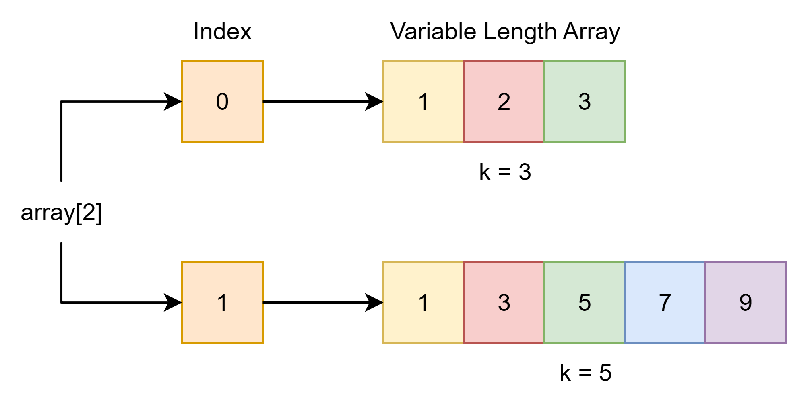
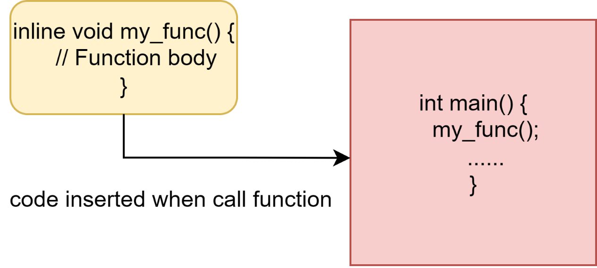
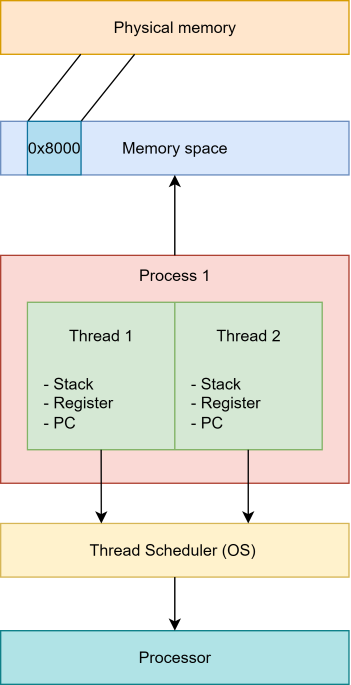
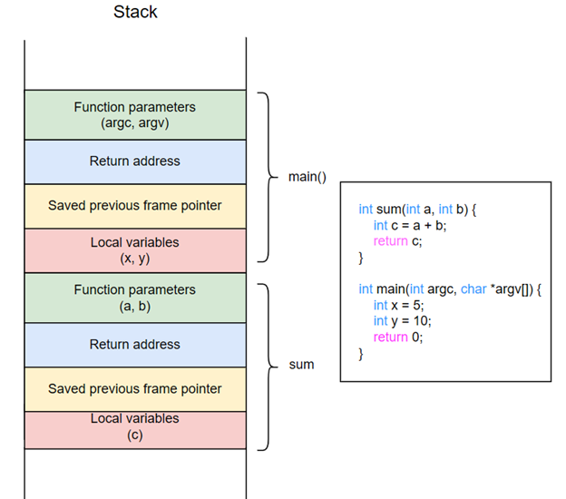

 # Lời mở đầu
Ngôn ngữ lập trình C, với bản chất cấp thấp và khả năng kiểm soát trực tiếp phần cứng cũng như bộ nhớ, đã trở thành nền tảng cho nhiều hệ thống quan trọng, từ hệ điều hành đến các ứng dụng nhúng. Tuy nhiên, khả năng kiểm soát này đi kèm với trách nhiệm lớn trong việc quản lý tài nguyên. Để phát triển các ứng dụng C mạnh mẽ, ổn định và hiệu quả, việc hiểu sâu sắc về các tiêu chuẩn ngôn ngữ và cấu trúc bộ nhớ là điều tối quan trọng.

Bài viết này sẽ cung cấp một phân tích chuyên sâu về các khía cạnh kỹ thuật cốt lõi này. Bài viết sẽ đi sâu vào sự phát triển và các tính năng chính của các tiêu chuẩn C99 và C11, giải thích chi tiết cấu trúc bộ nhớ của một chương trình C khi thực thi, làm rõ cơ chế của Stack Frame và vai trò của con trỏ ngăn xếp, đồng thời phân tích các lỗi bộ nhớ phổ biến như stack overflow, out of memory và memory leak, cùng với các phương pháp xử lý và phòng tránh hiệu quả.
# 1. Phân tích tiêu chuẩn C99 và C11
## 1.1. Tổng quan về sự phát triển của các tiêu chuẩn ngôn ngữ C
Ngôn ngữ C ra đời vào đầu những năm 1970 và nhanh chóng trở thành một công cụ mạnh mẽ để lập trình hệ thống, đặc biệt là trong việc phát triển hệ điều hành.1 Để đảm bảo tính tương thích và thúc đẩy sự phát triển của ngôn ngữ, một loạt các tiêu chuẩn đã được ban hành. C89/C90, còn được biết đến là ANSI C hoặc ISO C, là phiên bản tiêu chuẩn hóa đầu tiên, ra mắt vào năm 1989 và 1990. Tiêu chuẩn này đã đặt nền móng cho nhiều tính năng cơ bản của C, bao gồm các kiểu dữ liệu, cấu trúc điều khiển và thư viện chuẩn, mà vẫn được sử dụng rộng rãi trong lập trình C hiện đại.

Sau C89/C90, ngôn ngữ C tiếp tục được phát triển thông qua các tiêu chuẩn mới như C99, C11 và C18 (còn gọi là C17, được xuất bản vào năm 2018). Mỗi tiêu chuẩn này đều mang đến những cải tiến và tính năng mới, nhằm đáp ứng nhu cầu ngày càng cao của các ứng dụng và môi trường lập trình hiện đại.

## 1.2. C99 - Các tính năng chính và cải tiến đột phá so với C90

C99 (ISO/IEC 9899:1999) là một bản sửa đổi đáng kể, giới thiệu nhiều tính năng mới nhằm tăng cường khả năng biểu đạt, hiệu suất và tính linh hoạt của ngôn ngữ C. Những bổ sung này đã giúp C duy trì vị thế của mình trong các lĩnh vực lập trình hệ thống và nhúng.

Một trong những tính năng nổi bật nhất của C99 là **Mảng có độ dài biến đổi (Variable-Length Arrays - VLA)**. Tính năng này cho phép lập trình viên khai báo các mảng với kích thước không cố định tại thời điểm biên dịch, mà được xác định tại thời điểm chạy chương trình. Điều này mang lại sự linh hoạt đáng kể trong việc quản lý bộ nhớ cục bộ, cho phép các hàm xử lý dữ liệu với kích thước động mà không cần cấp phát bộ nhớ động trên heap. Tuy nhiên, việc sử dụng VLA cũng tiềm ẩn rủi ro về lỗi tràn ngăn xếp (stack overflow) nếu kích thước mảng quá lớn, vì chúng được cấp phát trên stack.



C99 cũng giới thiệu **Thành viên mảng linh hoạt (Flexible Array Members)**, cho phép phần tử cuối cùng của một cấu trúc (struct) là một mảng không xác định kích thước. Điều này đặc biệt hữu ích cho việc cấp phát bộ nhớ động liền kề với cấu trúc, giúp tối ưu hóa việc sử dụng bộ nhớ và cải thiện hiệu suất truy cập dữ liệu.

Để hỗ trợ các ứng dụng khoa học và kỹ thuật, C99 đã thêm hỗ trợ cho **Số phức (Complex Numbers)**. Tính năng này cung cấp các kiểu dữ liệu và toán tử cần thiết để làm việc với số phức một cách tự nhiên trong ngôn ngữ.

**Hàm nội tuyến (Inline Functions)** là một cải tiến khác nhằm cải thiện hiệu suất. Bằng cách sử dụng từ khóa inline, lập trình viên có thể đề xuất trình biên dịch chèn mã của hàm trực tiếp vào vị trí gọi, thay vì thực hiện một lời gọi hàm thông thường. Điều này giúp giảm chi phí lời gọi hàm và có thể dẫn đến mã thực thi nhanh hơn, đặc biệt đối với các hàm nhỏ được gọi thường xuyên.



**Khởi tạo được chỉ định (Designated Initializers)** mang lại sự rõ ràng và linh hoạt hơn trong việc khởi tạo các cấu trúc và mảng. Tính năng này cho phép lập trình viên khởi tạo các thành viên cụ thể của struct theo tên hoặc các phần tử cụ thể của mảng theo chỉ số, mà không cần phải khởi tạo tất cả các thành viên theo thứ tự khai báo.

Ngoài ra, C99 còn giới thiệu bình luận một dòng bắt đầu bằng ```//```, tương tự như trong C++ hoặc BCPL, mang lại sự tiện lợi hơn so với cặp ```/*... */``` truyền thống. Các kiểu dữ liệu mới như
**long long int** được thêm vào để hỗ trợ số nguyên có kích thước lớn hơn, và hỗ trợ cho macro đa biến (variadic macros) cũng được bổ sung. C99 cũng trở nên nghiêm ngặt hơn so với C90 ở một số điểm; đáng chú ý là một khai báo thiếu bộ chỉ định kiểu không còn mặc định là **int** nữa. Tiêu chuẩn này cũng bao gồm nhiều hàm thư viện mới và cập nhật các hàm hiện có.


## 1.3. C11 - Các tính năng chính và cải tiến quan trọng so với C99
C11 (ISO/IEC 9899:2011) là tiêu chuẩn tiếp theo sau C99, tập trung vào việc chuẩn hóa các tính năng đã được hỗ trợ bởi các trình biên dịch phổ biến và đặc biệt là cải thiện hỗ trợ cho các hệ thống đa luồng và đồng thời.

Một trong những bổ sung quan trọng nhất của C11 là hỗ trợ đa luồng trực tiếp trong ngôn ngữ, cung cấp một mô hình bộ nhớ chi tiết để hỗ trợ tốt hơn cho nhiều luồng thực thi. Điều này bao gồm bộ chỉ định lớp lưu trữ **_Thread_local** cho các biến cục bộ của luồng, thư viện **<threads.h>** cung cấp các hàm tạo/quản lý luồng, mutex, biến điều kiện và chức năng lưu trữ dành riêng cho luồng.



C11 cũng mang lại cải thiện hỗ trợ Unicode dựa trên Báo cáo Kỹ thuật Unicode C ISO/IEC TR 19769:2004. Điều này bao gồm các kiểu char16_t và char32_t để lưu trữ dữ liệu được mã hóa UTF-16/UTF-32, các hàm chuyển đổi trong **<uchar.h>**, và các tiền tố ký tự chuỗi u và U, cũng như tiền tố u8 cho các ký tự được mã hóa UTF-8.3
Một thay đổi đáng chú ý khác là loại bỏ hàm **gets**. Hàm này đã bị phản đối trong bản sửa đổi tiêu chuẩn C trước đó (ISO/IEC 9899:1999/Cor.3:2007(E)) do tính không an toàn của nó, dễ gây ra **lỗi tràn bộ đệm (buffer overflow)** khi đọc dữ liệu đầu vào. C11 khuyến khích sử dụng hàm **fgets** an toàn hơn để thay thế.

C11 giới thiệu **biểu thức kiểu chung (_Generic)**, cho phép chọn một biểu thức dựa trên kiểu của đối số. Điều này rất hữu ích cho việc tạo các macro đa năng, ví dụ như đoạn code sau:

```c
#include <stdio.h>

void print_int(int x) {
    printf("int: %d\n", x);
}

void print_double(double x) {
    printf("double: %f\n", x);
}

void print_string(const char* x) {
    printf("string: %s\n", x);
}

// Macro chọn hàm tương ứng dựa vào kiểu
#define print(x) _Generic((x), int: print_int, double: print_double, const char*: print_string, char*: print_string)(x)

int main() {
    int i = 42;
    double d = 3.14;
    const char* s = "Hello";

    print(i); // Gọi print_int
    print(d); // Gọi print_double
    print(s); // Gọi print_string

    return 0;
}
```

**Khẳng định tĩnh (_Static_assert)** là một tính năng mới cho phép kiểm tra các điều kiện tại thời điểm biên dịch, cung cấp thông báo lỗi sớm hơn so với các kiểm tra thời gian chạy. C11 cũng thêm hỗ trợ cho cấu trúc và union ẩn danh, giúp việc lồng các cấu trúc và union trở nên thuận tiện hơn, cho phép truy cập các thành viên dễ dàng hơn.

Các bổ sung khác bao gồm hàm quick_exit như một cách thứ ba để chấm dứt chương trình, nhằm thực hiện ít nhất việc hủy khởi tạo tối thiểu. C11 cũng giới thiệu chế độ tạo và mở độc quyền (
"…x" suffix) cho **fopen**, hoạt động giống như **O_CREAT|O_EXCL** trong POSIX, thường được sử dụng cho các tệp khóa.

Một điểm đặc biệt của C11 là việc cho phép các triển khai không hỗ trợ một số phần nhất định của tiêu chuẩn, bao gồm cả một số tính năng đã từng là bắt buộc trong C99 (ví dụ: mảng có độ dài biến đổi - VLA, các nguyên thủy nguyên tử, đa luồng).

 Các chương trình có thể sử dụng các macro được định nghĩa trước (ví dụ: __STDC_NO_VLA__) để kiểm tra xem một triển khai có hỗ trợ một tính năng cụ thể hay không, điều này giúp các nhà cung cấp trình biên dịch dễ dàng tuân thủ tiêu chuẩn cốt lõi hơn. Tuy nhiên, các giao diện kiểm tra giới hạn tùy chọn (Annex K) và tính năng phân tích (Annex L) vẫn còn gây tranh cãi và chưa được triển khai rộng rãi.

 ## 1.4. Tác động và ý nghĩa thực tiễn của các tiêu chuẩn này đối với lập trình hiện đại

C99 đã mang lại nhiều tiện ích và khả năng biểu đạt mạnh mẽ hơn cho C, giúp ngôn ngữ này duy trì tính cạnh tranh trong các lĩnh vực lập trình hệ thống và nhúng. Các tính năng như VLA và inline functions cho phép tối ưu hóa hiệu suất và linh hoạt hơn trong quản lý bộ nhớ cục bộ.

Sự tiến hóa của C từ C99 sang C11 phản ánh nhu cầu của phần cứng hiện đại và lập trình đa lõi. C11 đánh dấu một bước tiến lớn trong việc hỗ trợ lập trình đồng thời và đa luồng trực tiếp trong ngôn ngữ C, điều cần thiết cho việc tận dụng các bộ xử lý đa lõi hiện đại. Việc chuẩn hóa mô hình bộ nhớ và các hoạt động nguyên tử giúp viết mã đa luồng an toàn hơn mà không cần phụ thuộc hoàn toàn vào các thư viện hệ điều hành cụ thể (như pthreads). Tuy nhiên, việc một số tính năng trở thành tùy chọn trong C11 có thể gây ra thách thức về tính di động của mã. Chẳng hạn, việc viết mã di động trong C11 có thể gặp khó khăn do không phải tất cả các thư viện chuẩn C trên các nền tảng như Windows đều hỗ trợ đầy đủ các tính năng này. Điều này buộc các nhà phát triển phải cân nhắc giữa việc áp dụng các tính năng mới của tiêu chuẩn và duy trì khả năng tương thích rộng rãi, hoặc phải sử dụng các thư viện dành riêng cho nền tảng.

Việc loại bỏ hàm gets trong C11 là một ví dụ điển hình về cách các tiêu chuẩn ngôn ngữ phản ứng với các lỗ hổng bảo mật đã biết và thúc đẩy các thực hành lập trình an toàn hơn. Hàm gets nổi tiếng là không an toàn do không có khả năng ngăn chặn tràn bộ đệm, một lỗ hổng bảo mật nghiêm trọng. Việc loại bỏ nó nhấn mạnh một xu hướng rộng hơn trong việc tiêu chuẩn hóa ngôn ngữ: liên tục phát triển để giải quyết các mối lo ngại về bảo mật và thúc đẩy các thực hành lập trình mạnh mẽ. Điều này cũng là một lời nhắc nhở mạnh mẽ cho các lập trình viên C về việc ưu tiên mã hóa an toàn, đặc biệt khi xử lý đầu vào/đầu ra và bộ đệm bộ nhớ, và hiểu rõ lý do tại sao một số hàm nhất định bị phản đối hoặc loại bỏ.

Mặc dù có nhiều bổ sung, C vẫn giữ được bản chất là một ngôn ngữ nhỏ gọn và cấp thấp. Nhiều lập trình viên cho rằng các thay đổi từ C99 đến C18/C17 là "khá nhỏ" và không thay đổi căn bản cách tiếp cận vấn đề. Điều này cho thấy sự ổn định và tập trung vào các nguyên tắc cốt lõi của C, đồng thời vẫn cho phép ngôn ngữ thích nghi với các yêu cầu của môi trường tính toán hiện đại.

# 2. Cấu trúc bộ nhớ của một chương trình C (Memory Layout)
## 2.1. Khái niệm và tầm quan trọng của cấu trúc bộ nhớ

Cấu trúc bộ nhớ của một chương trình C mô tả cách dữ liệu và mã của chương trình được tổ chức và lưu trữ trong bộ nhớ máy tính trong suốt quá trình thực thi. Việc hiểu rõ cấu trúc này là nền tảng không thể thiếu đối với mọi lập trình viên C. Nó không chỉ giúp quản lý bộ nhớ hiệu quả, tối ưu hóa hiệu suất ứng dụng mà còn là chìa khóa để chẩn đoán và tránh các lỗi nghiêm trọng như lỗi phân đoạn **(segmentation faults)** và rò rỉ bộ nhớ **(memory leaks)**. Một chương trình C được tổ chức thành các vùng bộ nhớ riêng biệt, mỗi vùng phục vụ một mục đích cụ thể trong vòng đời của chương trình.

## 2.2. Phân tích chi tiết các phân đoạn bộ nhớ
Bộ nhớ của một chương trình C được chia thành năm phân đoạn chính, mỗi phân đoạn có chức năng và đặc điểm riêng biệt


### 2.2.1. Text Segment
- Chức năng: Phân đoạn text là nơi lưu trữ mã máy đã được biên dịch của chương trình. Nó chứa tất cả các lệnh và hàm mà chương trình sẽ thực thi.
- Đặc điểm: Phân đoạn này thường chỉ đọc (read-only) để ngăn chặn việc sửa đổi mã một cách vô ý hoặc độc hại trong khi chương trình đang chạy. Điều này cũng giúp tăng cường bảo mật. Một đặc điểm quan trọng khác là phân đoạn text có thể được chia sẻ giữa nhiều tiến trình chạy cùng một chương trình (ví dụ: các ứng dụng phổ biến như trình soạn thảo văn bản hoặc shell), giúp tiết kiệm bộ nhớ RAM đáng kể. Về vị trí, nó thường được đặt ở các địa chỉ thấp hơn của bộ nhớ ảo của tiến trình.
### 2.2.2. Initialized Data Segment
- Chức năng: Phân đoạn data lưu trữ các biến toàn cục (global variables) và biến tĩnh (static variables) với điều kiện các biến này được khởi tạo với giá trị khác 0.
- Ví dụ:
  ```c
  int a = 5;
  static int b = 1;
  ```
- Đặc điểm: Khác với phân đoạn text, phân đoạn data có quyền đọc-ghi (read-write) vì giá trị của các biến này có thể thay đổi trong quá trình thực thi chương trình. Phân đoạn này có thể được chia nhỏ hơn thành vùng đọc-ghi và vùng chỉ đọc; ví dụ, các biến được khai báo với từ khóa **const** (hằng số) thường được lưu trữ ở vùng chỉ đọc trong phân đoạn data. Nó nằm ngay phía trên phân vùng text trong cấu trúc bộ nhớ.
### 2.2.3. Uninitialized Data Segment (BSS)
- Chức năng: Phân đoạn BSS chứa các biến toàn cục và biến tĩnh không được khởi tạo giá trị ban đầu hoặc khởi tạo với giá trị bằng 0.
- Ví dụ:
  ```c
  int a;
  int b = 0;
  ```
- Đặc điểm: Các biến trong phân đoạn BSS được hệ điều hành tự động khởi tạo bằng 0 (đối với số học) hoặc con trỏ NULL (đối với con trỏ) tại thời điểm chạy, trước khi chương trình bắt đầu thực thi. Phân đoạn này cũng có quyền đọc-ghi.

## 2.2.4. Heap Segment
- Chức năng: Phân đoạn heap là nơi diễn ra việc cấp phát bộ nhớ động (dynamic memory allocation) trong thời gian chạy của chương trình. Đây là vùng bộ nhớ linh hoạt, cho phép chương trình yêu cầu và giải phóng bộ nhớ khi cần thiết.
- Đặc điểm: Bộ nhớ trên heap được quản lý bởi các hàm thư viện chuẩn như **malloc()**, **calloc()**, **realloc()**, và **free()**. Vùng heap bắt đầu ở cuối phân đoạn BSS và phát triển về phía các địa chỉ lớn hơn. Vùng nhớ này sẽ phình lên (grows upward) mỗi khi cấp phát. Khi sử dụng xong phải delete vùng nhớ này. Nếu quên không delete sẽ gây ra hiện tượng Memory Leak.
- Ví dụ:
  ```c
  int *ptr = (*int)malloc(sizeof(int));
  ```

## 2.2.5. Stack segment
- Chức năng: Stack là một vùng bộ nhớ được sử dụng cho các biến cục bộ (local variables), tham số hàm, và quản lý lời gọi hàm.
- Đặc điểm: Stack hoạt động theo cấu trúc LIFO (Last In First Out). Mỗi khi một hàm được gọi, một khung stack (stack frame) được tạo ra và đẩy vào stack để lưu trữ các biến cục bộ, tham số, và địa chỉ trả về của hàm gọi.


  
-  Stack thường nằm ở các địa chỉ cao hơn của bộ nhớ ảo và phát triển ngược chiều với heap (tức là về phía địa chỉ thấp hơn trên hầu hết các kiến trúc). Khi con trỏ stack và con trỏ heap gặp nhau, điều đó báo hiệu rằng bộ nhớ trống của chương trình đã cạn kiệt dẫn đến lỗi kinh điển Stack overflow.
