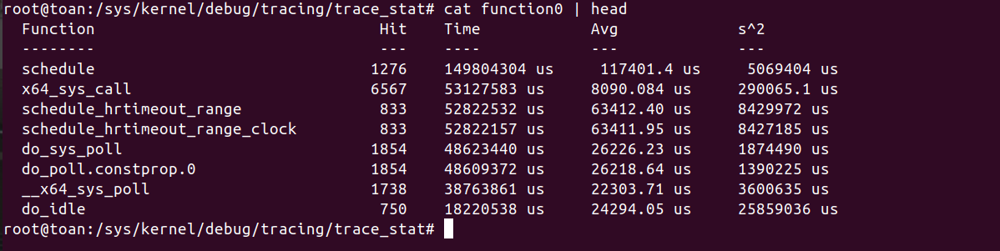

## B1: tracer
### 1. nop tracer

Ý nghĩa: "No operation" – không thực hiện việc trace gì cả.

Đặc điểm:

- Là trạng thái mặc định khi bạn không muốn tracer nào hoạt động.

- Dùng để tắt tạm thời việc trace mà không xóa cấu hình.

Áp dụng khi:

- Muốn giữ lại cấu hình filter, option… nhưng tạm dừng thu log.

- Dùng như “reset” trước khi chuyển sang tracer khác.

### 2. function tracer

Ý nghĩa: Ghi lại mỗi lần một hàm trong kernel được gọi.

Đặc điểm:

- Cực kỳ chi tiết, có thể log hàng trăm nghìn sự kiện/giây.

- Có thể lọc chỉ trace một số hàm bằng file set_ftrace_filter.

- Ghi thời điểm vào buffer ftrace mỗi khi hàm được gọi.

Áp dụng khi:

- Muốn biết luồng thực thi (execution flow) trong kernel hoặc driver.

- Debug xem hàm nào được gọi, với thứ tự và tần suất thế nào.

Nhược điểm: Overhead cao nếu trace toàn bộ kernel, nên hay dùng filter.

### 3. function_graph tracer

Ý nghĩa: Ghi lại cả call graph (cấu trúc lời gọi hàm) kèm thời gian thực thi từng hàm.

Đặc điểm:

- Hiển thị hàm cha – hàm con theo dạng cây thụt lề.

- Có thể giới hạn độ sâu bằng max_graph_depth.

- Cho thấy thời gian (delta time) mà mỗi hàm chạy.

Áp dụng khi:

- Phân tích performance: xem hàm nào tốn thời gian nhất.

- Debug luồng gọi hàm phức tạp.

Nhược điểm: Nặng hơn function tracer vì phải đo thời gian và dựng cây lời gọi.

### 4. blk tracer

Ý nghĩa: Trace các sự kiện liên quan đến block layer I/O (đọc/ghi thiết bị block như HDD, SSD).

Đặc điểm:

- Ghi lại các event như request được gửi, hoàn tất, sắp xếp (merge)…

- Hữu ích để debug latency I/O, phân tích throughput.

Áp dụng khi:

- Điều tra vấn đề chậm disk I/O ở mức kernel.

- Debug driver block hoặc hệ thống lưu trữ.

### 5. mmiotrace tracer

Ý nghĩa: Trace các truy cập MMIO (Memory-Mapped I/O) trong kernel.

Đặc điểm:

- Log các đọc/ghi tới các vùng bộ nhớ ánh xạ phần cứng.

- Thường dùng để phân tích hành vi driver khi giao tiếp với phần cứng qua MMIO.

Áp dụng khi:

- Reverse-engineering driver (đặc biệt cho thiết bị chưa có driver open source).

- Debug các vấn đề liên quan đến thiết bị phần cứng (GPU, NIC…) dùng MMIO.

## B12: trace and trace_pipe
### 1. ```trace```

- Vị trí: ```/sys/kernel/debug/tracing/trace```

- Chức năng:

1. Lưu snapshot (bản chụp) của dữ liệu trace hiện tại.

2. Mỗi lần bạn đọc file này, nó sẽ trả về toàn bộ nội dung buffer hiện tại và giữ nguyên dữ liệu trong buffer.

3. Thích hợp khi bạn muốn đọc tĩnh để phân tích hoặc lưu log một lần.

4. Nếu dữ liệu trong buffer bị ghi đè (do vòng đệm – ring buffer), bạn sẽ mất thông tin cũ, nhưng việc đọc file này không xóa dữ liệu đang có.

### 2. ```trace_pipe```

- Vị trí: /sys/kernel/debug/tracing/trace_pipe

- Chức năng:

1. Hoạt động giống như ống pipe: dữ liệu được xuất ra liên tục khi có sự kiện.

2. Khi bạn đọc từ file này, dữ liệu sẽ bị xóa khỏi buffer ngay sau khi đọc.

3. Cho phép đọc dữ liệu real-time (thời gian thực) khi các event xảy ra.

4. Không cần phải lo dữ liệu cũ lẫn vào, nhưng nếu bạn đọc không kịp → sẽ mất event.

5. Thường được dùng trong các tình huống streaming log hoặc phân tích trực tiếp.
## B17:

```tracing_thresh``` dùng để lọc thời gian các function mặc định là 0

Ví dụ:
```bash
echo 10000 > tracing_thresh
```
Tức là khi ```cat trace``` sẽ chỉ có các hàm có duration lớn hơn 10ms được hiển thị.
## B18:
Chức năng của ```max_graph_depth```:

- Đây là tham số giới hạn độ sâu tối đa của cây lời gọi hàm (call graph) mà function graph tracer sẽ ghi lại.

- "Depth" (độ sâu) ở đây là số tầng hàm lồng nhau:

1. Depth = 0: chỉ hàm gốc (root function)

2. Depth = 1: hàm gốc + các hàm được gọi trực tiếp từ nó

3. Depth = 2: thêm một tầng hàm con nữa, v.v.

Mục đích: tránh việc trace quá sâu, gây buffer tràn, tốn CPU, và khó phân tích log.

Sử dụng:
```bash
# mặc định là 0
cat /sys/kernel/debug/tracing/max_graph_depth

# Giới hạn độ sâu trace thành 5
echo 5 > /sys/kernel/debug/tracing/max_graph_depth
```
## B19: irqs-off
### 1. IRQ và IRQs-off là gì?

- IRQ (Interrupt Request): tín hiệu từ phần cứng yêu cầu CPU tạm dừng công việc hiện tại để xử lý một sự kiện (ví dụ: dữ liệu từ bàn phím, network card, timer…).

- IRQs-off: trạng thái mà CPU tạm thời vô hiệu hóa việc nhận IRQ.
Điều này thường xảy ra khi kernel đang thực hiện các tác vụ quan trọng cần atomic context (không bị gián đoạn).

### 2. irqs-off tracer làm gì?

Khi bật irqs-off tracer, ftrace sẽ:

- Ghi lại call stack tại thời điểm IRQ bị tắt.

- Đo thời gian từ lúc IRQ bị tắt đến lúc được bật lại.

- Nếu thời gian này vượt ngưỡng cấu hình → ghi log để phát hiện đoạn code giữ IRQs-off quá lâu.

Mục đích:

- Tìm các đoạn code trong kernel giữ interrupts tắt lâu bất thường → dễ gây latency hoặc miss deadline trong hệ thống real-time.

- Giúp debug vấn đề về performance hoặc latency trong driver/hệ thống.

### 3. Cách bật irqs-off
```bash
# Bật ftrace
mount -t debugfs none /sys/kernel/debug

# Chọn tracer
echo irqs-off > /sys/kernel/debug/tracing/current_tracer

# Xem kết quả
cat /sys/kernel/debug/tracing/trace
```
## 4. Ví dụ log
```
# tracer: irqs-off
#
#           TASK-PID   CPU#     TIMESTAMP  FUNCTION
#              | |      |          |       |
     ksoftirqd/0-3     [000] d...  45.123: disable_irqs: duration=120 us
     ...
```

duration = thời gian CPU ở trạng thái IRQs-off.

## B22: preempt-depth
Sử dụng để tránh lỗi race condition khi truy cập vào tài nguyên chung. Nếu preempt_count > 0 thì CPU không thể thực hiện chuyển đổi ngữ cảnh sang task khác.

preempt_disable() thì count +1
preempt_enable() thì count -1

Khi count = 0 thì thực hiện chuyển đổi ngữ cảnh.

## B27: Stack dump

Function stack dump là hiển thị thứ tự gọi hàm theo chiều ngược từ kernel -> user space xem hàm nào đã gọi nó ngược với call graph trong function graph

Sử dụng
``` bash
echo 1 options/func_stack_trace
```
để hiển thị stack dump function.

Ứng dụng:

- Debug kernel module: Xem hàm của bạn được gọi trong ngữ cảnh nào.

- Phân tích performance: Tìm call path dài bất thường.

- Tìm bug: Khi 1 hàm chạy không mong muốn, dùng stacktrace để biết nó bị ai gọi.

## B30: Function profilling
Kernel function profiling là quá trình đo lường tần suất và thời gian chạy của các hàm trong kernel.

Mục tiêu: tìm ra hàm nào chạy nhiều nhất, tốn CPU nhất, hoặc gây nút thắt hiệu năng (bottleneck).

Ví dụ
```bash
echo function > current_tracer
echo 1 > function_profile_enable
cd trace_stat
cat function0
```



Trong đó:
- Hit → số lần hàm được gọi.
- Time (ns) → tổng thời gian CPU dành cho hàm đó.
- Avg (ns) → trung bình mỗi lần gọi mất bao nhiêu thời gian.

## B31:
### Khái niệm: Interrupts Disabled

Khi CPU disable interrupts (tắt ngắt), CPU không thể xử lý bất kỳ external event nào:

Timer interrupt (ngắt đồng hồ) → nếu bị chặn, kernel không nhận biết được “tick” thời gian.

Device interrupt (chuột, bàn phím, card mạng…) → sự kiện không được báo ngay cho kernel.

Hệ quả: gây latency (độ trễ) trong phản ứng của hệ thống.

### irqsoff tracer là gì?

irqsoff là một loại latency tracer trong ftrace.

Nó theo dõi tất cả các đoạn code trong kernel mà interrupts bị disable.

Cách hoạt động:

- Bắt đầu trace khi CPU gọi local_irq_disable() hoặc tương đương.
- Kết thúc trace khi interrupts được bật lại (local_irq_enable()).
- Đo thời gian interrupts bị disable trong khoảng đó.
- Nếu thời gian này lớn hơn giá trị maximum trước đó, nó: 
Ghi lại stack trace/hành trình gọi hàm đã dẫn đến độ trễ.
 Xoá trace cũ và thay bằng trace mới.

Nói cách khác: irqsoff giúp bạn tìm đoạn code tệ nhất (worst-case) gây ra “interrupt-off latency”.

### Tại sao cần dùng?

Kernel realtime (RT), hoặc hệ thống nhúng, cần đảm bảo phản hồi ngắt nhanh.

Nếu có chỗ trong kernel disable IRQ quá lâu → gây deadline miss hoặc jitter cao.

irqsoff giúp bạn phát hiện chỗ đó để tối ưu.

### Điều kiện biên dịch

Tracer này không mặc định bật trong kernel.

Bạn cần bật trong config:
```bash
CONFIG_IRQSOFF_TRACER=y
```
## B34:
### Vấn đề khi debug kernel

Khi kernel panic / oops → hệ thống dừng lại, bạn chỉ thấy backtrace tại thời điểm crash.

Nhưng thường nguyên nhân thật sự xảy ra từ trước đó (một function gọi sai, disable irq quá lâu, deadlock trước khi panic…).

Nếu chỉ nhìn stack ở thời điểm crash → nhiều khi không tìm ra nguồn gốc.

Do đó, ta muốn có ngữ cảnh trước khi crash.

### Ftrace giúp gì?

Ftrace ghi lại lịch sử function call, event, latency… ngay trong kernel.

Nếu cấu hình "ftrace_dump_on_oops" = 1, thì khi kernel panic, Ftrace buffer sẽ được dump thẳng vào console / dmesg cùng với oops message.

Nghĩa là:
Ngoài stacktrace ở chỗ crash, bạn còn có log "lịch sử chạy" của CPU/function → biết kernel đã làm gì ngay trước khi chết.

### Cách bật
```bash
# Bật dump ftrace log khi oops
echo 1 > /proc/sys/kernel/ftrace_dump_on_oops
```
## B35: Trace event - format file
Khi sử dụng Ftrace để theo dõi các sự kiện kernel, bạn sẽ thấy mỗi sự kiện (event) có một tệp `format` riêng để mô tả cấu trúc của dữ liệu được ghi lại. Đoạn code và văn bản bạn cung cấp chính là định dạng của sự kiện `sched_switch`.

Dưới đây là giải thích chi tiết về cấu trúc của tệp `format`:

---

### Cấu trúc chung của tệp `format`

Tệp `format` định nghĩa cách các trường dữ liệu được sắp xếp và lưu trữ trong bộ đệm vòng (ring buffer) của Ftrace. Mỗi trường có các thông tin sau:

* **`field-type`**: Kiểu dữ liệu của trường (ví dụ: `unsigned short`, `int`, `char`).
* **`field-name`**: Tên của trường (ví dụ: `common_type`, `prev_comm`).
* **`offset`**: Vị trí bắt đầu của trường tính từ đầu bản ghi sự kiện, tính bằng byte.
* **`size`**: Kích thước của trường, tính bằng byte.

Dựa vào `offset` và `size`, Ftrace có thể đọc và phân tích từng trường dữ liệu một cách chính xác.

---

### Phân tích từng trường trong `sched_switch`

Sự kiện `sched_switch` xảy ra khi kernel chuyển đổi từ một tiến trình này sang một tiến trình khác.  Định dạng của nó bao gồm hai phần chính: các trường **`common`** và các trường **riêng của sự kiện**.

#### 1. Các trường `common`

Đây là những trường có mặt trong hầu hết mọi sự kiện trace của kernel. Chúng cung cấp các thông tin chung về ngữ cảnh của sự kiện:

* **`field:unsigned short common_type;`**: Kiểu sự kiện. Giá trị này thường khớp với **ID** của sự kiện, trong trường hợp này là **323**.
* **`field:unsigned char common_flags;`**: Các cờ trạng thái, thường cho biết liệu ngắt (interrupts) có được bật hay tắt khi sự kiện xảy ra.
* **`field:unsigned char common_preempt_count;`**: Trạng thái **preemption** (khả năng bị chiếm quyền CPU). Nó cho biết liệu preemption có được bật hay tắt và liệu tiến trình đang chạy trong ngữ cảnh ngắt, tiến trình, hay NMI (Non-Maskable Interrupt).
* **`field:int common_pid;`**: ID của tiến trình (PID) đang thực hiện lệnh gọi hệ thống.

#### 2. Các trường riêng của `sched_switch`

Những trường này cung cấp thông tin chi tiết về hai tiến trình tham gia vào quá trình chuyển đổi.

* **`field:char prev_comm[16];`**: Tên của tiến trình vừa bị ngắt (previous process), được lưu dưới dạng một mảng ký tự có kích thước 16 byte.
* **`field:pid_t prev_pid;`**: ID của tiến trình vừa bị ngắt.
* **`field:int prev_prio;`**: Độ ưu tiên của tiến trình vừa bị ngắt.
* **`field:long prev_state;`**: Trạng thái của tiến trình vừa bị ngắt (ví dụ: đang chạy, đang ngủ, không thể ngắt).
* **`field:char next_comm[16];`**: Tên của tiến trình sắp được chạy (next process).
* **`field:pid_t next_pid;`**: ID của tiến trình sắp được chạy.
* **`field:int next_prio;`**: Độ ưu tiên của tiến trình sắp được chạy.

### Tóm lại

Tệp `format` là "bản thiết kế" cho dữ liệu sự kiện. Nó giúp các công cụ phân tích dữ liệu như Ftrace và `trace-cmd` hiểu cách đọc và hiển thị các bản ghi sự kiện một cách chính xác, từ đó giúp các nhà phát triển kernel dễ dàng gỡ lỗi và phân tích hành vi của hệ thống.

## B36: Trace event - filter file
Filtering Events (lọc sự kiện) trong Ftrace là một cơ chế mạnh mẽ cho phép bạn chỉ ghi lại những sự kiện đáp ứng các tiêu chí cụ thể. Thay vì ghi lại tất cả mọi thứ, bạn có thể "lọc" bớt các sự kiện không cần thiết, giúp giảm dung lượng file trace và làm cho việc phân tích dữ liệu dễ dàng hơn.


### Cách thức hoạt động

Quá trình lọc sự kiện diễn ra ngay lập tức. Khi một sự kiện được ghi vào bộ đệm trace (trace buffer), các trường dữ liệu của nó (ví dụ: `pid`, `comm`, `prio`) sẽ được so sánh với biểu thức lọc mà bạn đã đặt.

  * **Nếu các giá trị trường khớp với biểu thức lọc**, sự kiện đó sẽ được lưu lại và xuất hiện trong output của trace.
  * **Nếu các giá trị không khớp**, sự kiện đó sẽ bị loại bỏ.
  * **Nếu không có bộ lọc nào được thiết lập**, tất cả các sự kiện sẽ được ghi lại theo mặc định.

### Thiết lập bộ lọc

Bạn thiết lập bộ lọc bằng cách ghi một biểu thức lọc vào tệp **`filter`** của sự kiện đó.

Ví dụ: Để lọc sự kiện `sched_switch`, bạn sẽ ghi biểu thức lọc vào tệp `events/sched/sched_switch/filter`.

### Biểu thức lọc (Filter Expressions)

Một biểu thức lọc bao gồm một hoặc nhiều **mệnh đề so sánh (predicates)**, được kết hợp bằng các toán tử logic **`&&` (AND)** hoặc **`||` (OR)**.

#### Mệnh đề so sánh (Predicate)

Một mệnh đề so sánh là một điều kiện kiểm tra giá trị của một trường dữ liệu so với một hằng số.

  * **Cú pháp**: `field-name relational-operator value`

      * **`field-name`**: Tên của trường dữ liệu, tìm thấy trong tệp `format` của sự kiện.
      * **`relational-operator`**: Toán tử so sánh.
      * **`value`**: Giá trị hằng số để so sánh.

Bạn có thể sử dụng dấu ngoặc đơn `()` để nhóm các mệnh đề lại với nhau và dấu ngoặc kép `""` để tránh các ký tự đặc biệt của shell.

#### Các loại toán tử so sánh

Các toán tử này thay đổi tùy thuộc vào kiểu dữ liệu của trường bạn đang so sánh:

  * **Trường số (Numeric Fields)**:
      * `==` (bằng), `!=` (không bằng)
      * `<` (nhỏ hơn), `<=` (nhỏ hơn hoặc bằng)
      * `>` (lớn hơn), `>=` (lớn hơn hoặc bằng)
      * `&` (phép toán AND bitwise)
  * **Trường chuỗi (String Fields)**:
      * `==` (bằng), `!=` (không bằng)
      * `~` (so khớp chuỗi theo mẫu - globbing), hỗ trợ các ký tự đại diện như `*` (đại diện cho một chuỗi bất kỳ), `?` (đại diện cho một ký tự bất kỳ) và `[]` (lớp ký tự).


### Ví dụ thực tế

Giả sử bạn chỉ muốn xem các sự kiện `sched_switch` khi tiến trình **`prev_comm`** là `"my_app"`.

Bạn có thể đặt bộ lọc như sau:

```bash
echo 'prev_comm == "my_app"' > /sys/kernel/debug/tracing/events/sched/sched_switch/filter
```

Hoặc nếu bạn muốn xem các sự kiện khi `prev_pid` là 1234 và `next_pid` không phải là 5678, bạn sẽ viết:

```bash
echo 'prev_pid == 1234 && next_pid != 5678' > /sys/kernel/debug/tracing/events/sched/sched_switch/filter
```

Sử dụng bộ lọc giúp bạn thu hẹp phạm vi trace, chỉ tập trung vào những thông tin bạn quan tâm, làm cho quá trình gỡ lỗi và phân tích hệ thống hiệu quả hơn rất nhiều.
