# 1. Vagrind là gì?
Valgrind là một framework công cụ mạnh mẽ và linh hoạt, được thiết kế để thực hiện phân tích động (dynamic analysis) các chương trình. Nó giúp các nhà phát triển phát hiện lỗi và tối ưu hóa hiệu suất của mã nguồn bằng cách chạy chương trình trên một CPU mô phỏng, cho phép nó kiểm tra mọi truy cập bộ nhớ và giá trị được tính toán. Valgrind hoạt động trực tiếp trên các tệp thực thi hiện có mà không yêu cầu biên dịch lại hay liên kết lại chương trình, hoạt động như một "thám tử" tỉ mỉ, theo dõi quá trình thực thi, phát hiện rò rỉ bộ nhớ, truy cập bộ nhớ không xác định và các lỗi khác ở cấp độ nhị phân.

Tại sao lỗi bộ nhớ lại khó phát hiện và nguy hiểm:
Trong lập trình C/C++, quản lý bộ nhớ thủ công là một nguồn gốc phổ biến của các lỗi khó nhằn. Những vấn đề như cấp phát sai kích thước, sử dụng con trỏ chưa khởi tạo, truy cập bộ nhớ sau khi đã giải phóng (use-after-free), hoặc tràn bộ đệm (buffer overrun) có thể gây ra những hậu quả nghiêm trọng. Các lỗi này có thể dẫn đến hành vi không mong muốn, treo chương trình (crash), hoặc đưa ra kết quả không chính xác.
# 2. Các lỗi bộ nhớ phổ biến
## 2.1. Invalid read/write of size X (Đọc/ghi không hợp lệ)

Xảy ra khi hương trình cố gắng đọc hoặc ghi X byte vào một vùng bộ nhớ không hợp lệ.4 Đây là một trong những lỗi phổ biến nhất và nghiêm trọng nhất.

Nguyên nhân phổ biến:

1. Truy cập vượt quá giới hạn khối heap được cấp phát (buffer overflow/overrun). Lỗi này thường là kết quả của lỗi "off-by-one" (lệch một đơn vị).
2. Truy cập bộ nhớ đã được giải phóng (use-after-free).
3. Truy cập vào vùng chưa được cấp phát (ví dụ: từ con trỏ chưa khởi tạo).
### 2.1.1. Truy cập vượt quá giới hạn khối heap được cấp phát

Ví dụ:
```c
#include <stdio.h>
#include <stdlib.h>
#include <string.h>

int main() {
    const char *src = "hello";
    
    // Lỗi chỉ cấp phát strlen(src) bytes, thiếu ký tự null ('\0')
    char *dest = (char *)malloc(strlen(src)); 
    
    strcpy(dest, src); // ➜ Gây lỗi ghi ngoài vùng nhớ

    printf("Copied string: %s\n", dest);
    
    free(dest);
    return 0;
}
```

Biên dịch và debug valgrind:
```bash
gcc -g -o exam main.c
valgrind ./exam
```
Debug với valgrind ta thu được:

Ta thấy Valgrind chỉ rõ lỗi đọc ghi không hợp lệ vào 1 byte ở dòng 11 và 13. Và đưa ra chỉ 5 byte được cấp phát ở dòng 9.

**Cách giải quyết:** cấp thêm 1 byte cho '\0'.
### 2.1.2. Truy cập bộ nhớ đã được giải phóng (use-after-free)
Ví dụ trong đoạn code sau minh họa lỗi xảy ra khi truy cập bộ nhớ đã được giải phóng:
```c
#include <stdio.h>
#include <stdlib.h>

int main() {
    int *pointer = (int *)malloc(sizeof(int));
    if (pointer == NULL) {
        perror("malloc failed");
        return 1;
    }
    
    *pointer = 100;
    printf("Value before free: %d\n", *pointer);

    free(pointer); // Giải phóng bộ nhớ
    if (pointer == NULL) {
        printf("error\n");
    }

    // Cố gắng truy cập bộ nhớ đã giải phóng
    printf("Value after free (INVALID READ): %d\n", *pointer); // Lỗi Invalid read
    *pointer = 200; // Lỗi Invalid write
    printf("New value after free (INVALID WRITE): %d\n", *pointer);

    return 0;
}
```
Build chương trình và debug với Valgrind:
```bash
gcc -g -o exam main.c
valgrind ./exam
```
Chạy chương trình ta được kết quả:


Debug với valgrind:


Ta thấy Valgrind báo cáo rằng chương trình đã cố gắng đọc/ghi 4 byte vào một vùng bộ nhớ không hợp lệ. Lỗi ghi không hợp lệ ở dòng 21 và đọc không hợp lệ ở dòng 22. Và chỉ ra rõ rằng vùng nhớ đã được giải phóng ở dòng 14.

**Cách khắc phục:** Sau khi giải phóng bộ nhớ, hãy gán con trỏ về ```NULL``` để tránh việc vô tình sử dụng lại nó. Hàm ```free(NULL)``` an toàn và không gây lỗi.
### 2.1.3. Truy cập vào vùng chưa được cấp phát

Ví dụ về con trỏ chưa được khởi tạo.
```c
#include <stdio.h>
#include <stdlib.h>

int main() {
    int *uninitialized_ptr; // Con trỏ chưa được khởi tạo

    // Cố gắng ghi vào địa chỉ mà con trỏ chưa khởi tạo trỏ tới
    *uninitialized_ptr = 10; // Lỗi Invalid write

    printf("Value: %d\n", *uninitialized_ptr); // Lỗi Invalid read

    return 0;
}
```
Sau khi chạy chương trình bị lỗi ```Segmentation fault (core dumped)```

Debug với Valgrind:


Valgrind chỉ ra lỗi không khởi tạo giá trị ở dòng 8 từ đó dẫn tới lỗi invalid write.

**Cách khắc phục:** Luôn khởi tạo con trỏ của bạn. Nếu bạn không biết nó sẽ trỏ đến đâu, hãy khởi tạo nó bằng ```NULL```. Nếu bạn muốn nó trỏ đến bộ nhớ hợp lệ, hãy cấp phát bộ nhớ cho nó bằng ```malloc``` hoặc gán nó cho một biến có địa chỉ hợp lệ.

## 2.2. Invalid free (giải phóng không hợp lệ)
Invalid free(): Chương trình cố gắng giải phóng một địa chỉ không phải từ heap, hoặc giải phóng cùng một khối bộ nhớ nhiều hơn một lần (double-free).

**Nguy hiểm của double-free:** Việc giải phóng bộ nhớ đã được giải phóng có thể làm hỏng cấu trúc quản lý heap của hệ thống, dẫn đến các sự cố không thể đoán trước, lỗi use-after-free hoặc lỗ hổng bảo mật nghiêm trọng.

Ví dụ:
```c
#include <stdio.h>
#include <stdlib.h>

int main() {
    char* str = (char*)malloc(10);
    if (str == NULL) {
        return 1;
    }

    free(str); // hợp lệ
    free(str); // Lỗi: double free
    return 0;
}
```
Chạy chương trình ta gặp lỗi:

Debug với Valgrind:


Valgrind chỉ ra đã free ở dòng 10 và lỗi invalid free ở dòng 11.

**Giải pháp cho double-free:** Một cách hiệu quả để tránh lỗi này là gán con trỏ về ```NULL``` ngay sau khi giải phóng lần đầu tiên. Hàm ```free(NULL)``` không gây ra lỗi.
## 2.3. Bad permissions
Xảy ra khi chương trình cố gắng ghi vào một vùng bộ nhớ chỉ đọc, ví dụ như các chuỗi ký tự được khai báo tĩnh.

Ví dụ:
```c
#include <stdio.h>

int main() {
    char *str = "hello"; // chuỗi literal — nằm ở vùng chỉ đọc (read-only)
    str[0] = 'H';        // Lỗi: ghi vào vùng nhớ không được phép

    printf("%s\n", str);
    return 0;
}
```
Chạy chương trình trên ta gặp lỗi ```Segmentation fault (core dumped)```

Debug với Valgrind:

Cách sửa đúng:
```c
char str[] = "hello";  // Chuỗi được copy vào vùng stack (có thể sửa)
str[0] = 'H';           // OK
```
# 3. Sử dụng Valgrind nâng cao
## 3.1. Tùy chỉnh Memcheck cho các trường hợp phức tạp
Memcheck là công cụ phổ biến nhất, nhưng nó cũng có nhiều tùy chọn nâng cao.
### 3.1.1. --track-origins=yes (Theo dõi nguồn gốc của giá trị chưa khởi tạo)

Đây là một trong những tùy chọn quan trọng nhất của ```Memcheck```. Khi bạn đọc một biến chưa được khởi tạo, Valgrind sẽ báo lỗi. Với ```--track-origins=yes```, nó không chỉ báo lỗi mà còn cho bạn biết giá trị đó đến từ đâu, giúp bạn truy tìm nguyên nhân gốc rễ dễ dàng hơn.

Ví dụ chương trình C gây lỗi đọc biến chưa được khởi tạo (uninitialized variable).
```c
#include <stdio.h>

int main() {
    int x;
    int y = x + 5;  // x chưa được khởi tạo, nhưng đã được sử dụng

    printf("y = %d\n", y);
    return 0;
}
```
Chạy valgrind không có ```--track-origins```
```bash
valgrind ./exam
```
Kết quả:

 Valgrind báo lỗi sử dụng giá trị chưa khởi tạo, nhưng không rõ nó đến từ đâu.

Chạy lại với ```--track-origins=yes```:
```bash
valgrind --track-origins=yes ./exam
```
Kết quả đầy đủ thông tin hơn:

 Valgrind bây giờ nói rõ ràng rằng giá trị chưa khởi tạo là do ```x``` được cấp phát trên stack ở dòng 4.

### 3.1.2. --leak-check=full và --show-reachable=yes (Kiểm tra rò rỉ bộ nhớ chi tiết)
- ```--leak-check=full``` sẽ hiển thị thông tin chi tiết về mọi rò rỉ bộ nhớ.

- ```--show-reachable=yes``` sẽ báo cáo cả những block bộ nhớ đã bị rò rỉ nhưng vẫn còn "địa chỉ truy cập" (reachable), tức là vẫn còn con trỏ trỏ đến chúng. Điều này hữu ích để tìm các rò rỉ "nhẹ" mà chương trình vẫn có thể truy cập được nhưng không thể giải phóng.

Ví dụ đoạn code C sau:
```c
#include <stdlib.h>
#include <string.h>

char *create_string(const char *input) {
    char *str = malloc(strlen(input) + 1);  // Cấp phát bộ nhớ
    strcpy(str, input);
    return str;
}

int main() {
    char *a = create_string("Hello");
    char *b = create_string("World");

    // Quên giải phóng 'a' => memory leak
    free(b);

    return 0;
}
```

Biến ```a``` không được free, dẫn đến rò rỉ bộ nhớ.

Nếu không dùng ```--show-reachable=yes```, sẽ không thấy thông tin về các vùng nhớ còn trỏ được tới (reachable) nhưng vẫn chưa giải phóng.

Debug với Valgrind:
```bash
valgrind --leak-check=full --show-reachable=yes ./exam
```
Kết quả debug:

Ta thấy được chi tiết về địa chỉ vùng nhớ chưa được giải phóng và chỉ rõ biến cấp phát ử dòng 11.

Giải thích các loại rò rỉ:

1. ```definitely lost```: Bộ nhớ đã mất hoàn toàn con trỏ => **rò rỉ thực sự**.
2. ```still reachable```: Vẫn còn trỏ tới được, nhưng không ```free``` => **có thể không rò rỉ**.
3. ```indirectly lost```: Mất bộ nhớ được trỏ tới qua các con trỏ khác (gián tiếp).
4. ```possibly lost```: Không chắc chắn mất, có thể bị lỗi trỏ không hợp lệ.
## 3.2. Valgrind client requests
Valgrind cung cấp một API nội bộ gọi là Valgrind client requests, cho phép bạn chèn các lệnh vào chương trình C/C++ để điều khiển quá trình kiểm tra — ví dụ như:

- Đánh dấu một vùng bộ nhớ là defined hoặc undefined

- Bắt đầu/dừng kiểm tra rò rỉ bộ nhớ

- Kiểm tra xem một vùng bộ nhớ đã được khởi tạo chưa

- Thêm các ghi chú vào báo cáo để dễ theo dõi

Trước hết, bạn cần:
```c
#include <valgrind/valgrind.h>
#include <valgrind/memcheck.h>
```
Đây là các file header do Valgrind cung cấp. Thư viện này chỉ có hiệu lực khi chạy dưới Valgrind — khi chạy thông thường, nó bị loại bỏ bởi các macro đặc biệt.

Một số Client Request phổ biến:

1. ```VALGRIND_MAKE_MEM_DEFINED(addr, len)```: Đánh dấu vùng nhớ là đã được khởi tạo.
2. ```VALGRIND_MAKE_MEM_UNDEFINED(addr, len)```: Đánh dấu là chưa khởi tạo.
3. ```VALGRIND_CHECK_MEM_IS_DEFINED(addr, len)```: Kiểm tra có vùng chưa khởi tạo.
4. ```VALGRIND_DO_LEAK_CHECK```: Gọi kiểm tra rò rỉ bộ nhớ tại thời điểm đó.
5. ```VALGRIND_PRINTF```: In log trực tiếp từ chương trình qua Valgrind.
### 3.2.1. VALGRIND_CHECK_MEM_IS_DEFINED
Ví dụ mã nguồn có sử dụng ```VALGRIND_CHECK_MEM_IS_DEFINED```:

```c
#include <stdio.h>
#include <stdlib.h>
#include <valgrind/memcheck.h>

int main() {
    char *buffer = malloc(10);

    // Giả lập sử dụng vùng nhớ chưa được khởi tạo
    if (VALGRIND_CHECK_MEM_IS_DEFINED(buffer, 10)) {
        printf("Buffer is uninitialized!\n");
    } else {
        printf("Buffer is already defined.\n");
    }

    free(buffer);
    return 0;
}
```
Trong code trên ```malloc``` cấp phát nhưng không khởi tạo giá trị.
```VALGRIND_CHECK_MEM_IS_DEFINED(ptr, size)``` trả về 1 nếu có lỗi, 0 nếu ổn.

Debug với Valgrind:
```bash
gcc -g -o exam main.c
valgrind ./exam
```

Kết quả:


Vùng chưa khởi tạo giá trị Valgrind sẽ báo lỗi với vị trí và stacktrace.

### 3.2.2. VALGRIND_DO_LEAK_CHECK
Ví dụ kiểm tra rò rỉ tại điểm giữa chương trình:
```c
#include <stdlib.h>
#include <valgrind/memcheck.h>

int main() {
    char *data = malloc(100);

    VALGRIND_DO_LEAK_CHECK; // Gọi kiểm tra rò rỉ tại đây

    free(data);
    return 0;
}
```
Debug với Valgrind:
```bash
gcc -g -o exam main.c
valgrind --leak-check=full ./exam
```
Kết quả:
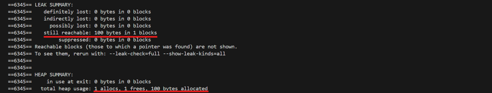

Valgrind kiểm tra 2 lần: 1 lần tại ```VALGRIND_DO_LEAK_CHECK```, 1 lần cuối chương trình.

### 3.2.3. VALGRIND_PRINTF
Ví dụ minh họa việc sử dụng ```VALGRIND_PRINTF``` để in ra thông tin kiểm tra và phát hiện sử dụng bộ nhớ chưa khởi tạo (uninitialized memory).

```c
#include <stdio.h>
#include <stdlib.h>
#include <valgrind/valgrind.h>
#include <valgrind/memcheck.h>

int main() {
    char *buffer = malloc(10);

    // Không khởi tạo buffer → chứa dữ liệu chưa xác định
    VALGRIND_PRINTF("=== Debug: Bắt đầu kiểm tra buffer...\n");

    // Sử dụng vùng nhớ chưa khởi tạo
    printf("Giá trị đầu tiên của buffer: %x\n", buffer[0]);

    // Kiểm tra vùng nhớ có được khởi tạo chưa
    if (VALGRIND_CHECK_MEM_IS_DEFINED(buffer, 10)) {
        VALGRIND_PRINTF("!!! Buffer chứa vùng nhớ chưa được khởi tạo!\n");
    } else {
        VALGRIND_PRINTF(">>> Buffer đã được khởi tạo.\n");
    }

    free(buffer);
    VALGRIND_PRINTF("=== Debug: Đã giải phóng buffer.\n");

    return 0;
}
```
Debug với Valgrind:
```bash
gcc -g -o exam main.c
valgrind ./exam
```
Kết quả:
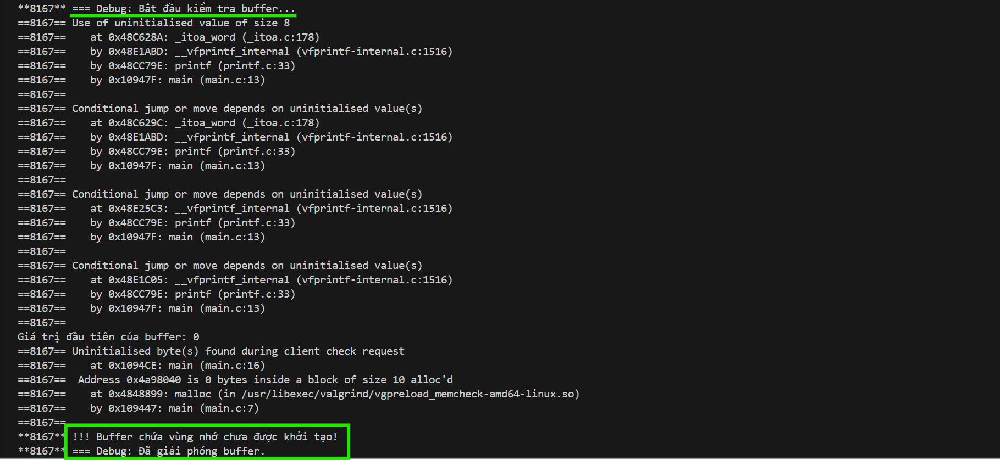

```VALGRIND_PRINTF(...)``` sẽ chỉ in thông báo khi chạy dưới Valgrind, không in khi chạy bình thường.
### 3.2.4. CALLGRIND_START_INSTRUMENTATION
```CALLGRIND_START_INSTRUMENTATION``` là một macro nằm trong Valgrind Callgrind API, được dùng để bắt đầu thu thập dữ liệu hiệu năng tại thời điểm tùy ý trong chương trình. Điều này rất hữu ích nếu bạn chỉ muốn phân tích một phần cụ thể trong chương trình, giúp tránh làm “loãng” dữ liệu với các phần không quan trọng như khởi tạo hoặc in log.

Ví dụ:
```c
#include <stdio.h>
#include <stdlib.h>
#include <valgrind/callgrind.h>

void waste_time() {
    volatile int sum = 0;
    for (int i = 0; i < 1000000; ++i)
        sum += i;
}

void target_function() {
    waste_time();
    printf("Inside target function.\n");
}

int main() {
    printf("Program starts.\n");

    // Phần khởi động không được đo
    waste_time();

    // Bắt đầu thu thập từ đây
    CALLGRIND_START_INSTRUMENTATION;

    target_function();

    // Ngừng thu thập tại đây
    CALLGRIND_STOP_INSTRUMENTATION;

    printf("Program ends.\n");

    return 0;
}
```
```waste_time()```: Hàm này được dùng để tiêu tốn CPU một cách giả lập.

```CALLGRIND_START_INSTRUMENTATION```: bắt đầu thu thập dữ liệu về cache misses, jump, call,...

```CALLGRIND_STOP_INSTRUMENTATION```: kết thúc việc thu thập.

Dữ liệu sẽ được lưu trong tệp ```callgrind.out.<pid>```, có thể xem bằng:
```bash
callgrind_annotate callgrind.out.<pid>
```
Dùng đồ họa với KCachegrind:
```bash
kcachegrind callgrind.out.<pid>
```
Giao diện sau khi chạy KCachegrind:
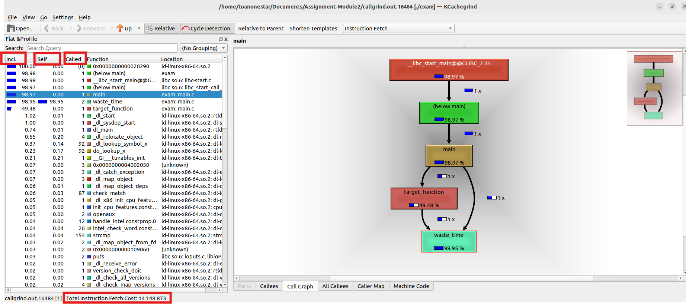

Trong đó:
- **Incl. (Inclusive)**: Tổng chi phí của hàm đó và toàn bộ các hàm mà nó gọi.
- **Self**: Chi phí tính riêng trong hàm đó (không tính các hàm gọi ra từ nó).
- **Called**: số lần gọi hàm.
- **Instruction Fetch**: Tổng số lệnh máy (assembly) được CPU lấy về để thực thi.

Từ biểu đồ Call Graph (đồ thị gọi hàm) ta thấy:
1. main()
- Chiếm 98.97% tổng instruction fetch.

- Bao gồm cả thời gian gọi target_function() và waste_time() trong main().

2. target_function()
- Chiếm 49.48% (tức ~7 triệu lệnh).

- Đây là phần được đo khi ```CALLGRIND``` được bật.

3. waste_time()
- Chiếm tới 98.95%, tức đây là nơi tiêu tốn CPU chính.

- Điều này đúng với dự đoán, vì nó có vòng lặp 1 triệu lần.


Ta có ví dụ rõ ràng hơn về việc so sánh giữa normal function và inline function:
```c
#include <stdio.h>

#define LOOP_COUNT 10000000

// Inline function
static inline int inline_add(int a, int b) {
    return a + b;
}

// Normal function
int normal_add(int a, int b) {
    return a + b;
}

int main() {
    int sum = 0;

    // Test inline function
    for (int i = 0; i < LOOP_COUNT; i++) {
        sum += inline_add(i, i);
    }

    // Test normal function
    for (int i = 0; i < LOOP_COUNT; i++) {
        sum += normal_add(i, i);
    }

    printf("Sum = %d\n", sum);
    return 0;
}
```
Debug với Valgrind:
```bash
gcc -g -O0 main.c -o exam
valgrind --tool=callgrind ./exam
kcachegrind callgrind.out.<PID>
```
Kết quả:
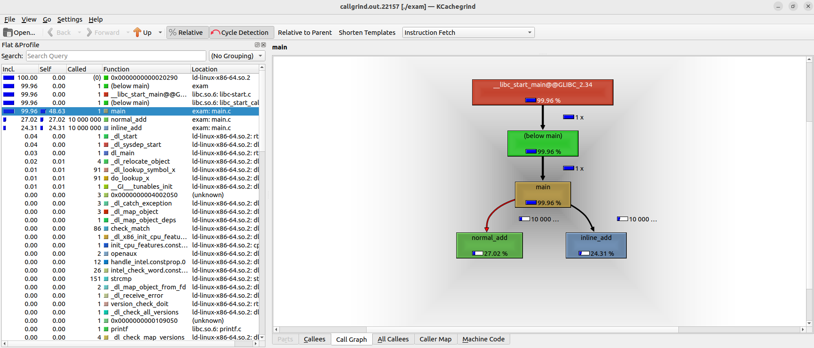

Ta thấy trực quan hơn về tác dụng của inline function.
## 3.3. Helgrind
**Mục đích**: Phát hiện lỗi đồng bộ hóa trong các chương trình đa luồng sử dụng các nguyên thủy luồng POSIX pthreads.

**Chức năng**: Phát hiện lạm dụng API pthreads, thứ tự khóa không nhất quán (có thể dẫn đến deadlock), và data race (truy cập bộ nhớ mà không có khóa hoặc đồng bộ hóa đầy đủ).

Ví dụ code C bị lỗi data race:
```c
#include <stdio.h>
#include <pthread.h>

int counter = 0;

void* thread_func(void* arg) {
    for (int i = 0; i < 1000000; ++i) {
        counter++;  // <- Lỗi data race ở đây
    }
    return NULL;
}

int main() {
    pthread_t t1, t2;

    pthread_create(&t1, NULL, thread_func, NULL);
    pthread_create(&t2, NULL, thread_func, NULL);

    pthread_join(t1, NULL);
    pthread_join(t2, NULL);

    printf("Final counter: %d\n", counter);
    return 0;
}
```
Biên dịch:
```bash
gcc -pthread -g -o exam main.c
```
Debug với Valgrind:
```bash
valgrind --tool=helgrind ./exam
```
Kết quả:
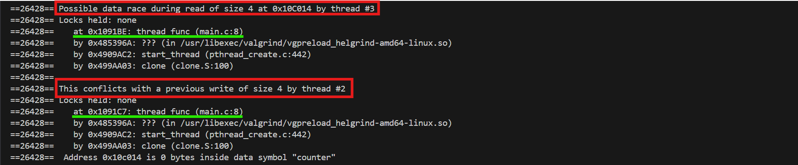

Hiển thị rõ 2 thread xung đột gây lỗi race conditon ở dòng 8 khi truy cập biến count.
# 4. Debug deadlock bằng GDB
Mô phỏng một hệ thống xử lý ngân hàng với 3 tài khoản, trong đó mỗi tài khoản có một ```pthread_mutex_t```. Các luồng thực hiện chuyển tiền giữa các tài khoản, nhưng do thứ tự khóa mutex không được kiểm soát, chương trình có thể bị deadlock ngẫu nhiên.

```c
#include <pthread.h>
#include <stdio.h>
#include <stdlib.h>
#include <unistd.h>

#define NUM_THREADS 3
#define NUM_ACCOUNTS 3

typedef struct {
    int balance;
    pthread_mutex_t lock;
} Account;

Account accounts[NUM_ACCOUNTS];

void transfer(int from, int to, int amount) {
    pthread_mutex_lock(&accounts[from].lock);
    sleep(1); // Mô phỏng độ trễ khiến deadlock dễ xảy ra
    pthread_mutex_lock(&accounts[to].lock);

    if (accounts[from].balance >= amount) {
        accounts[from].balance -= amount;
        accounts[to].balance += amount;
        printf("Transferred %d from account %d to account %d\n", amount, from, to);
    } else {
        printf("Transfer failed: insufficient funds in account %d\n", from);
    }

    pthread_mutex_unlock(&accounts[to].lock);
    pthread_mutex_unlock(&accounts[from].lock);
}

void* thread_func(void* arg) {
    int id = *((int*)arg);
    int from = id;
    int to = (id + 1) % NUM_ACCOUNTS;
    int amount = 100;

    // Lặp nhiều lần để tăng xác suất deadlock
    for (int i = 0; i < 5; i++) {
        transfer(from, to, amount);
        usleep(100000); // 100ms
    }
    return NULL;
}

int main() {
    pthread_t threads[NUM_THREADS];
    int thread_ids[NUM_THREADS];

    // Khởi tạo tài khoản
    for (int i = 0; i < NUM_ACCOUNTS; i++) {
        accounts[i].balance = 1000;
        pthread_mutex_init(&accounts[i].lock, NULL);
    }

    for (int i = 0; i < NUM_THREADS; i++) {
        thread_ids[i] = i;
        pthread_create(&threads[i], NULL, thread_func, &thread_ids[i]);
    }

    for (int i = 0; i < NUM_THREADS; i++) {
        pthread_join(threads[i], NULL);
    }

    for (int i = 0; i < NUM_ACCOUNTS; i++) {
        printf("Account %d balance: %d\n", i, accounts[i].balance);
        pthread_mutex_destroy(&accounts[i].lock);
    }

    return 0;
}
```

Biên dịch và bật debug đầy đủ:
```bash
gcc -g -pthread main.c -o exam
gdb ./exam
```
Sử dụng lệnh sau trong GDB để kiểm tra các thread hiện có và đang bị block hay không.
```bash
info threads
thread apply all bt
```
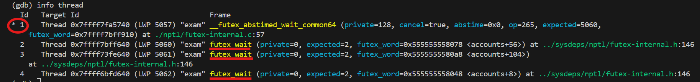

Ta thấy hiện tại chương trình đang ở thread có ```id = 1``` đây chính là main thread. 3 thread còn lại là các thread được tạo ra. Ta thấy ở 3 thread đều có trạng thái ```futex_wait``` có nghĩa là đang bị block và chờ khóa mutex. Điều này có nguy cơ dẫn tới deadlock.

Để xem chi tiết các thread đang giữ khóa nào ta sẽ switch qua thread đó và dùng lệnh ```bt```:
```bash
thread 2
bt
```
Ta được kết quả như sau:
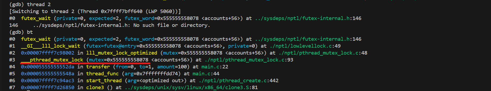

Ta thấy thread 2 đang chờ khóa mutex có địa chỉ ```0x555555558078```.

Ta sẽ xem giá trị địa chỉ của các khóa mutex này bằng cách:
```bash
p &accounts[0].lock
p &accounts[1].lock
p &accounts[2].lock
```
Ta được kết quả:
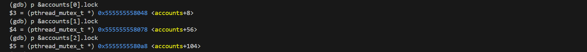

Như vậy thread có ```id = 2``` đang bị block bởi khóa mutex ```accounts[1].lock```.

Và để xem thread nào đang giữ ```accounts[1].lock``` ta làm như sau:
```bash
 p *(&accounts[1].lock)
```
Ta được kết quả:
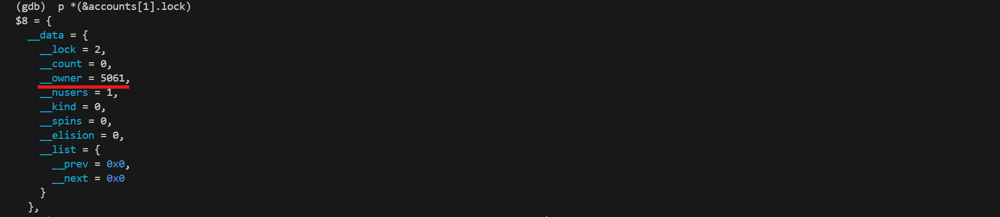

Ta thấy khóa mutex đang được giữ bởi thread có giá trị LWP 5061, đối chiếu với info thread thì đó là thread ```id = 3```:
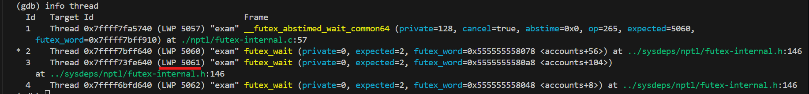

Tương tự làm với 2 thread còn lại ta thấy ở đây gặp lỗi chờ vòng lặp thread này chờ khóa mutex được giữ bởi thread sau đó. Điều này chính là nguyên nhân gây ra deadlock.

Khắc phục bằng cách kiểm soát khóa mutex có trật tự:
```c
int first_lock = (from < to) ? from : to;
int second_lock = (from < to) ? to : from;

pthread_mutex_lock(&accounts[from].lock);
sleep(1);
pthread_mutex_lock(&accounts[to].lock);
```
Và chương trình cho ra kết quả:
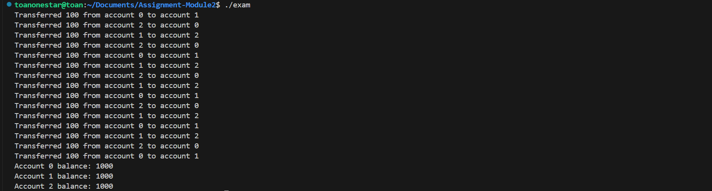
