# 1. Vagrind là gì?
Valgrind là một framework công cụ mạnh mẽ và linh hoạt, được thiết kế để thực hiện phân tích động (dynamic analysis) các chương trình. Nó giúp các nhà phát triển phát hiện lỗi và tối ưu hóa hiệu suất của mã nguồn bằng cách chạy chương trình trên một CPU mô phỏng, cho phép nó kiểm tra mọi truy cập bộ nhớ và giá trị được tính toán. Valgrind hoạt động trực tiếp trên các tệp thực thi hiện có mà không yêu cầu biên dịch lại hay liên kết lại chương trình, hoạt động như một "thám tử" tỉ mỉ, theo dõi quá trình thực thi, phát hiện rò rỉ bộ nhớ, truy cập bộ nhớ không xác định và các lỗi khác ở cấp độ nhị phân.

Tại sao lỗi bộ nhớ lại khó phát hiện và nguy hiểm:
Trong lập trình C/C++, quản lý bộ nhớ thủ công là một nguồn gốc phổ biến của các lỗi khó nhằn. Những vấn đề như cấp phát sai kích thước, sử dụng con trỏ chưa khởi tạo, truy cập bộ nhớ sau khi đã giải phóng (use-after-free), hoặc tràn bộ đệm (buffer overrun) có thể gây ra những hậu quả nghiêm trọng. Các lỗi này có thể dẫn đến hành vi không mong muốn, treo chương trình (crash), hoặc đưa ra kết quả không chính xác.
# 2. Các lỗi bộ nhớ phổ biến
## 2.1. Invalid read/write of size X (Đọc/ghi không hợp lệ)

Xảy ra khi hương trình cố gắng đọc hoặc ghi X byte vào một vùng bộ nhớ không hợp lệ.4 Đây là một trong những lỗi phổ biến nhất và nghiêm trọng nhất.

Nguyên nhân phổ biến:

1. Truy cập vượt quá giới hạn khối heap được cấp phát (buffer overflow/overrun). Lỗi này thường là kết quả của lỗi "off-by-one" (lệch một đơn vị).
2. Truy cập bộ nhớ đã được giải phóng (use-after-free).
3. Truy cập vào vùng chưa được cấp phát (ví dụ: từ con trỏ chưa khởi tạo).
### 2.1.1. Truy cập vượt quá giới hạn khối heap được cấp phát

Ví dụ:
```c
#include <stdio.h>
#include <stdlib.h>
#include <string.h>

int main() {
    const char *src = "hello";
    
    // Lỗi chỉ cấp phát strlen(src) bytes, thiếu ký tự null ('\0')
    char *dest = (char *)malloc(strlen(src)); 
    
    strcpy(dest, src); // ➜ Gây lỗi ghi ngoài vùng nhớ

    printf("Copied string: %s\n", dest);
    
    free(dest);
    return 0;
}
```

Biên dịch và debug valgrind:
```bash
gcc -g -o exam main.c
valgrind ./exam
```
Debug với valgrind ta thu được:
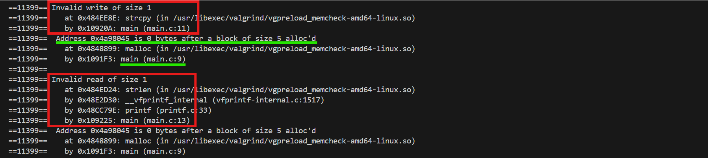
Ta thấy Valgrind chỉ rõ lỗi đọc ghi không hợp lệ vào 1 byte ở dòng 11 và 13. Và đưa ra chỉ 5 byte được cấp phát ở dòng 9.

**Cách giải quyết:** cấp thêm 1 byte cho '\0'.
### 2.1.2. Truy cập bộ nhớ đã được giải phóng (use-after-free)
Ví dụ trong đoạn code sau minh họa lỗi xảy ra khi truy cập bộ nhớ đã được giải phóng:
```c
#include <stdio.h>
#include <stdlib.h>

int main() {
    int *pointer = (int *)malloc(sizeof(int));
    if (pointer == NULL) {
        perror("malloc failed");
        return 1;
    }
    
    *pointer = 100;
    printf("Value before free: %d\n", *pointer);

    free(pointer); // Giải phóng bộ nhớ
    if (pointer == NULL) {
        printf("error\n");
    }

    // Cố gắng truy cập bộ nhớ đã giải phóng
    printf("Value after free (INVALID READ): %d\n", *pointer); // Lỗi Invalid read
    *pointer = 200; // Lỗi Invalid write
    printf("New value after free (INVALID WRITE): %d\n", *pointer);

    return 0;
}
```
Build chương trình và debug với Valgrind:
```bash
gcc -g -o exam main.c
valgrind ./exam
```
Chạy chương trình ta được kết quả:
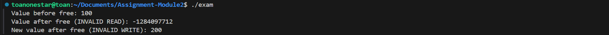

Debug với valgrind:
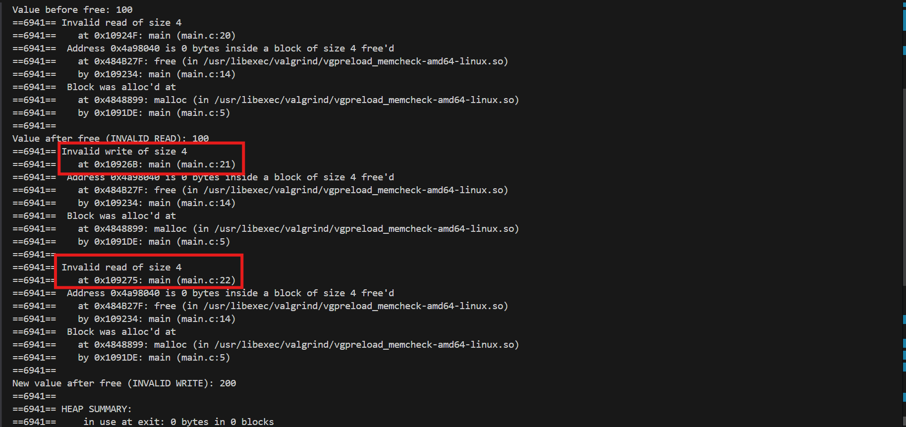

Ta thấy Valgrind báo cáo rằng chương trình đã cố gắng đọc/ghi 4 byte vào một vùng bộ nhớ không hợp lệ. Lỗi ghi không hợp lệ ở dòng 21 và đọc không hợp lệ ở dòng 22. Và chỉ ra rõ rằng vùng nhớ đã được giải phóng ở dòng 14.

**Cách khắc phục:** Sau khi giải phóng bộ nhớ, hãy gán con trỏ về ```NULL``` để tránh việc vô tình sử dụng lại nó. Hàm ```free(NULL)``` an toàn và không gây lỗi.
### 2.1.3. Truy cập vào vùng chưa được cấp phát

Ví dụ về con trỏ chưa được khởi tạo.
```c
#include <stdio.h>
#include <stdlib.h>

int main() {
    int *uninitialized_ptr; // Con trỏ chưa được khởi tạo

    // Cố gắng ghi vào địa chỉ mà con trỏ chưa khởi tạo trỏ tới
    *uninitialized_ptr = 10; // Lỗi Invalid write

    printf("Value: %d\n", *uninitialized_ptr); // Lỗi Invalid read

    return 0;
}
```
Sau khi chạy chương trình bị lỗi ```Segmentation fault (core dumped)```

Debug với Valgrind:
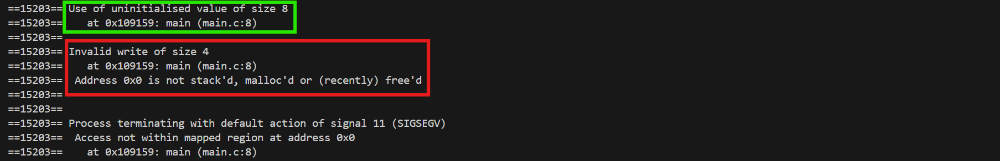

Valgrind chỉ ra lỗi không khởi tạo giá trị ở dòng 8 từ đó dẫn tới lỗi invalid write.

**Cách khắc phục:** Luôn khởi tạo con trỏ của bạn. Nếu bạn không biết nó sẽ trỏ đến đâu, hãy khởi tạo nó bằng ```NULL```. Nếu bạn muốn nó trỏ đến bộ nhớ hợp lệ, hãy cấp phát bộ nhớ cho nó bằng ```malloc``` hoặc gán nó cho một biến có địa chỉ hợp lệ.

## 2.2. Invalid free (giải phóng không hợp lệ)
Invalid free(): Chương trình cố gắng giải phóng một địa chỉ không phải từ heap, hoặc giải phóng cùng một khối bộ nhớ nhiều hơn một lần (double-free).

**Nguy hiểm của double-free:** Việc giải phóng bộ nhớ đã được giải phóng có thể làm hỏng cấu trúc quản lý heap của hệ thống, dẫn đến các sự cố không thể đoán trước, lỗi use-after-free hoặc lỗ hổng bảo mật nghiêm trọng.

Ví dụ:
```c
#include <stdio.h>
#include <stdlib.h>

int main() {
    char* str = (char*)malloc(10);
    if (str == NULL) {
        return 1;
    }

    free(str); // hợp lệ
    free(str); // Lỗi: double free
    return 0;
}
```
Chạy chương trình ta gặp lỗi:
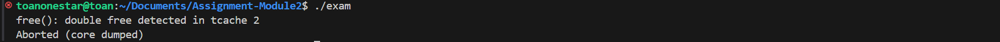
Debug với Valgrind:
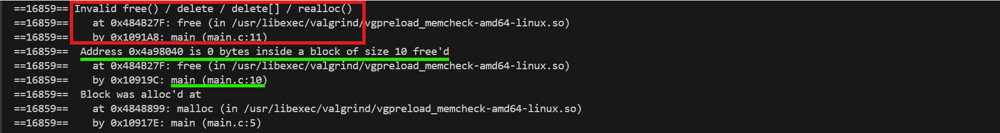

Valgrind chỉ ra đã free ở dòng 10 và lỗi invalid free ở dòng 11.

**Giải pháp cho double-free:** Một cách hiệu quả để tránh lỗi này là gán con trỏ về ```NULL``` ngay sau khi giải phóng lần đầu tiên. Hàm ```free(NULL)``` không gây ra lỗi.
## 2.3. Bad permissions
Xảy ra khi chương trình cố gắng ghi vào một vùng bộ nhớ chỉ đọc, ví dụ như các chuỗi ký tự được khai báo tĩnh.

Ví dụ:
```c
#include <stdio.h>

int main() {
    char *str = "hello"; // chuỗi literal — nằm ở vùng chỉ đọc (read-only)
    str[0] = 'H';        // Lỗi: ghi vào vùng nhớ không được phép

    printf("%s\n", str);
    return 0;
}
```
Chạy chương trình trên ta gặp lỗi ```Segmentation fault (core dumped)```

Debug với Valgrind:
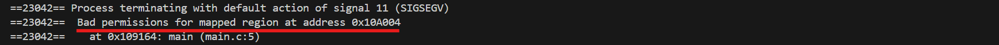
Cách sửa đúng:
```c
char str[] = "hello";  // Chuỗi được copy vào vùng stack (có thể sửa)
str[0] = 'H';           // OK
```
# 3. Sử dụng Valgrind nâng cao
## 3.1. Tùy chỉnh Memcheck cho các trường hợp phức tạp
Memcheck là công cụ phổ biến nhất, nhưng nó cũng có nhiều tùy chọn nâng cao.
### 3.1.1. --track-origins=yes (Theo dõi nguồn gốc của giá trị chưa khởi tạo)

Đây là một trong những tùy chọn quan trọng nhất của ```Memcheck```. Khi bạn đọc một biến chưa được khởi tạo, Valgrind sẽ báo lỗi. Với ```--track-origins=yes```, nó không chỉ báo lỗi mà còn cho bạn biết giá trị đó đến từ đâu, giúp bạn truy tìm nguyên nhân gốc rễ dễ dàng hơn.

Ví dụ chương trình C gây lỗi đọc biến chưa được khởi tạo (uninitialized variable).
```c
#include <stdio.h>

int main() {
    int x;
    int y = x + 5;  // x chưa được khởi tạo, nhưng đã được sử dụng

    printf("y = %d\n", y);
    return 0;
}
```
Chạy valgrind không có ```--track-origins```
```bash
valgrind ./exam
```
Kết quả:
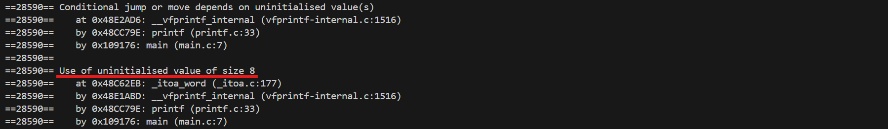
 Valgrind báo lỗi sử dụng giá trị chưa khởi tạo, nhưng không rõ nó đến từ đâu.

Chạy lại với ```--track-origins=yes```:
```bash
valgrind --track-origins=yes ./exam
```
Kết quả đầy đủ thông tin hơn:
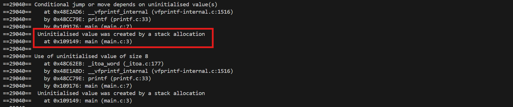
 Valgrind bây giờ nói rõ ràng rằng giá trị chưa khởi tạo là do ```x``` được cấp phát trên stack ở dòng 4.

### 3.1.2. --leak-check=full và --show-reachable=yes (Kiểm tra rò rỉ bộ nhớ chi tiết)
- ```--leak-check=full``` sẽ hiển thị thông tin chi tiết về mọi rò rỉ bộ nhớ.

- ```--show-reachable=yes``` sẽ báo cáo cả những block bộ nhớ đã bị rò rỉ nhưng vẫn còn "địa chỉ truy cập" (reachable), tức là vẫn còn con trỏ trỏ đến chúng. Điều này hữu ích để tìm các rò rỉ "nhẹ" mà chương trình vẫn có thể truy cập được nhưng không thể giải phóng.

Ví dụ đoạn code C sau:
```c
#include <stdlib.h>
#include <string.h>

char *create_string(const char *input) {
    char *str = malloc(strlen(input) + 1);  // Cấp phát bộ nhớ
    strcpy(str, input);
    return str;
}

int main() {
    char *a = create_string("Hello");
    char *b = create_string("World");

    // Quên giải phóng 'a' => memory leak
    free(b);

    return 0;
}
```

Biến ```a``` không được free, dẫn đến rò rỉ bộ nhớ.

Nếu không dùng ```--show-reachable=yes```, sẽ không thấy thông tin về các vùng nhớ còn trỏ được tới (reachable) nhưng vẫn chưa giải phóng.

Debug với Valgrind:
```bash
valgrind --leak-check=full --show-reachable=yes ./exam
```
Kết quả debug:
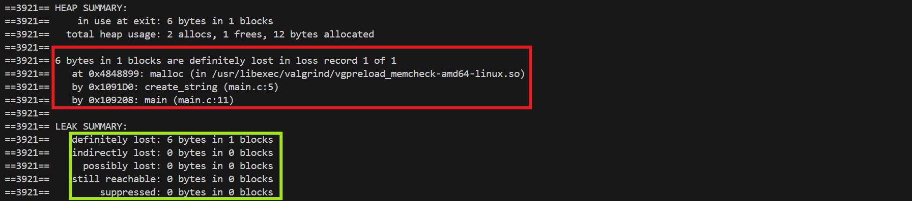
Ta thấy được chi tiết về địa chỉ vùng nhớ chưa được giải phóng và chỉ rõ biến cấp phát ử dòng 11.

Giải thích các loại rò rỉ:

1. ```definitely lost```: Bộ nhớ đã mất hoàn toàn con trỏ => **rò rỉ thực sự**.
2. ```still reachable```: Vẫn còn trỏ tới được, nhưng không ```free``` => **có thể không rò rỉ**.
3. ```indirectly lost```: Mất bộ nhớ được trỏ tới qua các con trỏ khác (gián tiếp).
4. ```possibly lost```: Không chắc chắn mất, có thể bị lỗi trỏ không hợp lệ.
### 3.2. Valgrind client requests
Valgrind cung cấp một API nội bộ gọi là Valgrind client requests, cho phép bạn chèn các lệnh vào chương trình C/C++ để điều khiển quá trình kiểm tra — ví dụ như:

- Đánh dấu một vùng bộ nhớ là defined hoặc undefined

- Bắt đầu/dừng kiểm tra rò rỉ bộ nhớ

- Kiểm tra xem một vùng bộ nhớ đã được khởi tạo chưa

- Thêm các ghi chú vào báo cáo để dễ theo dõi

Trước hết, bạn cần:
```c
#include <valgrind/valgrind.h>
#include <valgrind/memcheck.h>
```
Đây là các file header do Valgrind cung cấp. Thư viện này chỉ có hiệu lực khi chạy dưới Valgrind — khi chạy thông thường, nó bị loại bỏ bởi các macro đặc biệt.

Một số Client Request phổ biến:

1. ```VALGRIND_MAKE_MEM_DEFINED(addr, len)```: Đánh dấu vùng nhớ là đã được khởi tạo.
2. ```VALGRIND_MAKE_MEM_UNDEFINED(addr, len)```: Đánh dấu là chưa khởi tạo.
3. ```VALGRIND_CHECK_MEM_IS_DEFINED(addr, len)```: Kiểm tra có vùng chưa khởi tạo.
4. ```VALGRIND_DO_LEAK_CHECK```: Gọi kiểm tra rò rỉ bộ nhớ tại thời điểm đó.
5. ```VALGRIND_PRINTF```: In log trực tiếp từ chương trình qua Valgrind.

Ví dụ mã nguồn có sử dụng ```VALGRIND_CHECK_MEM_IS_DEFINED```:

```c
#include <stdio.h>
#include <stdlib.h>
#include <valgrind/memcheck.h>

int main() {
    char *buffer = malloc(10);

    // Giả lập sử dụng vùng nhớ chưa được khởi tạo
    if (VALGRIND_CHECK_MEM_IS_DEFINED(buffer, 10)) {
        printf("Buffer is uninitialized!\n");
    } else {
        printf("Buffer is already defined.\n");
    }

    free(buffer);
    return 0;
}
```
Trong code trên ```malloc``` cấp phát nhưng không khởi tạo giá trị.
```VALGRIND_CHECK_MEM_IS_DEFINED(ptr, size)``` trả về 1 nếu có lỗi, 0 nếu ổn.

Debug với Valgrind:
```bash
gcc -g -o exam main.c
valgrind ./exam
```

Kết quả:
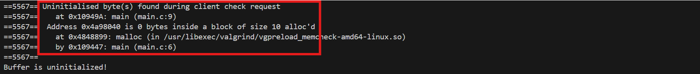

Vùng chưa khởi tạo giá trị Valgrind sẽ báo lỗi với vị trí và stacktrace.