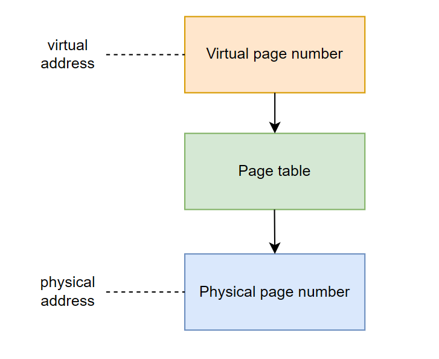

Bài viết này đi sâu vào các khía cạnh của bộ nhớ ảo, từ các nguyên tắc cơ bản đến cách hệ điều hành quản lý nó và cách các chương trình C tương tác với cơ chế mạnh mẽ này.

# 1. Giới thiệu về Bộ nhớ ảo (Virtual Memory)
Bộ nhớ ảo là kỹ thuật quản lý bộ nhớ nền tảng, tạo ảo ảnh về một bộ nhớ rất lớn cho người dùng và ứng dụng. Nó kết hợp RAM với bộ nhớ trên ổ đĩa (SSD/HDD) để tạo không gian địa chỉ liên tục. Hệ điều hành (OS), với sự hỗ trợ của phần cứng và phần mềm, ánh xạ địa chỉ ảo (chương trình sử dụng) thành địa chỉ vật lý (RAM thực tế).

Mục đích chính của bộ nhớ ảo không chỉ mở rộng dung lượng bộ nhớ vật lý bằng cách tận dụng không gian đĩa. Nó còn cung cấp bảo vệ bộ nhớ bằng cách dịch địa chỉ ảo sang vật lý, ngăn chặn truy cập trái phép. Điều này cho phép chạy các chương trình lớn hơn RAM, giải phóng ứng dụng khỏi quản lý bộ nhớ chia sẻ, tăng cường bảo mật qua cô lập bộ nhớ, và cho phép nhà phát triển sử dụng nhiều bộ nhớ hơn mức vật lý có sẵn.

Bộ nhớ ảo ra đời những năm 1960-1970 khi RAM đắt đỏ, giúp các hệ thống lớn chạy trên máy tính ít RAM, mang lại lợi ích kinh tế. Dù chi phí RAM giảm, bộ nhớ ảo vẫn thiết yếu nhờ các lợi ích phi chi phí như không gian địa chỉ ảo riêng biệt, tăng cường bảo mật và độ tin cậy, đặc biệt trong môi trường đa nhiệm. Nó đã trở thành thành phần kiến trúc cốt lõi của các hệ điều hành hiện đại, hỗ trợ bảo mật và hiệu suất cao.

Hệ thống bộ nhớ ảo đầu tiên được triển khai trên Máy tính Atlas, sử dụng phân trang. Ngày nay, bộ nhớ ảo là phần không thể thiếu của kiến trúc máy tính hiện đại, yêu cầu hỗ trợ phần cứng như MMU tích hợp trong CPU. Hầu hết các OS hiện đại chạy mỗi tiến trình trong không gian địa chỉ riêng biệt, tạo ảo giác mỗi chương trình có quyền truy cập duy nhất vào toàn bộ bộ nhớ ảo, đơn giản hóa lập trình.

# 2. Các khái niệm cốt lõi của Bộ nhớ ảo

Để hiểu bộ nhớ ảo, cần nắm vững các thành phần kỹ thuật cơ bản.

## 2.1. Địa chỉ ảo và Địa chỉ vật lý: Sự khác biệt và mối quan hệ

Trong hệ thống bộ nhớ ảo, chương trình dùng **địa chỉ ảo** (trừu tượng, liên tục) thay vì trực tiếp địa chỉ vật lý.
**Địa chỉ vật lý** là địa chỉ thực tế trong RAM nơi dữ liệu lưu trữ.

OS, với phần cứng, ánh xạ địa chỉ ảo sang vật lý. Mỗi tiến trình có không gian địa chỉ ảo riêng, tạo ảo giác truy cập bộ nhớ liên tục và độc quyền, dù RAM vật lý có thể phân mảnh và chia sẻ.

Sự ảo hóa này đơn giản hóa lập trình và tăng cường bảo mật. Nó ẩn đi sự phức tạp của bộ nhớ vật lý, cho phép lập trình viên làm việc như thể có bộ nhớ lớn, liên tục. Mỗi tiến trình có không gian địa chỉ ảo riêng, ngăn chặn truy cập trái phép, đảm bảo ổn định và bảo mật hệ thống, cho phép đa nhiệm an toàn.

## 2.2. Đơn vị quản lý bộ nhớ (MMU) và Quá trình dịch địa chỉ

MMU (Đơn vị quản lý bộ nhớ), tích hợp trong CPU, dịch địa chỉ ảo sang vật lý. CPU truy cập địa chỉ ảo, MMU dịch.

Để tăng tốc dịch, MMU dùng TLB (Translation Lookaside Buffer) lưu ánh xạ gần đây. TLB được tìm trước; nếu khớp (TLB hit), dịch nhanh. Nếu không (TLB miss), MMU hoặc OS tra cứu bảng trang chính (page walk) để tìm địa chỉ vật lý.

## 2.3. Phân trang (Paging) và Khung trang (Page Frames)

Phân trang chia bộ nhớ ảo thành "trang" (pages) và bộ nhớ vật lý thành "khung trang" (frames) có kích thước cố định, 4KB-16KB. Trang ảo được ánh xạ tới khung trang vật lý.

Phân trang cho phép phân bổ không gian địa chỉ không liên tục trong RAM. Các phần chương trình có thể ở các vị trí vật lý khác nhau nhưng vẫn liên tục trong không gian ảo, giúp tránh phân mảnh bộ nhớ bên ngoài. 

## 2.4. Bảng trang (Page Tables) và Các mục nhập bảng trang (PTEs)

Bảng trang lưu ánh xạ địa chỉ ảo và vật lý. Mỗi tiến trình có bảng trang riêng, đảm bảo không gian bộ nhớ ảo liên tục và cô lập.

Mỗi ánh xạ trong bảng trang được gọi là một mục nhập bảng trang (PTE - Page Table Entry). Một PTE chứa thông tin cần thiết để ánh xạ một trang ảo cụ thể tới một khung trang vật lý tương ứng. Ngoài số khung trang vật lý (PFN - Page Frame Number), PTE còn chứa nhiều thông tin phụ trợ quan trọng khác:
- **Present/Valid Bit:** Chỉ ra liệu trang có đang nằm trong bộ nhớ vật lý (RAM) hay không. Nếu bit này không được đặt, nghĩa là trang không có trong RAM, việc truy cập trang sẽ kích hoạt một lỗi trang (page fault).
- **Dirty/Modified Bit:** Cho biết liệu nội dung của trang đã được sửa đổi kể từ khi nó được tải vào RAM hay chưa. Nếu trang đã bị sửa đổi, nó được coi là "dirty" và phải được ghi lại vào đĩa (hoán đổi ra ngoài) trước khi khung trang của nó có thể được giải phóng hoặc tái sử dụng.
- **Accessed Bit:** Cho biết liệu trang đã được truy cập (đọc hoặc ghi) gần đây hay không. Bit này được sử dụng bởi một số thuật toán thay thế trang (ví dụ: LRU) để theo dõi việc sử dụng trang.
- **Read/Write (Protection) Bits:** Xác định các quyền truy cập (chỉ đọc, đọc/ghi, thực thi) đối với trang.9 Các bit bảo vệ này rất quan trọng để tăng cường bảo mật bộ nhớ, ngăn chặn các tiến trình thực hiện các thao tác không được phép.
- **User/Supervisor Bit:** Xác định liệu trang có thể được truy cập bởi mã người dùng hay chỉ bởi kernel (chế độ đặc quyền).
- **Global Bit:** Chỉ ra rằng trang này không được xóa khỏi TLB khi chuyển đổi ngữ cảnh, hữu ích cho các trang được chia sẻ bởi nhiều tiến trình hoặc các trang kernel.
- **Process ID/Address Space ID (ASID):** Trong các hệ điều hành không phải là không gian địa chỉ đơn, thông tin này cần thiết để phân biệt các ánh xạ ảo của các tiến trình khác nhau, vì hai tiến trình có thể sử dụng cùng một địa chỉ ảo cho các mục đích khác nhau.

# 3. Vai trò của Hệ điều hành trong Quản lý Bộ nhớ ảo

OS quản lý bộ nhớ ảo, điều phối RAM vật lý và bộ nhớ thứ cấp để tạo ảo ảnh về không gian bộ nhớ lớn hơn.

## 3.1. Cơ chế phân trang và Hoán đổi (Swapping)

OS dùng phân trang để chuyển dữ liệu giữa RAM và đĩa, quản lý bộ nhớ hiệu quả. Hoán đổi (swapping) cho phép OS cấp phát bộ nhớ cho các tiến trình cần nhiều hơn RAM vật lý. Nó dùng không gian đĩa (tệp hoán đổi) như phần mở rộng của RAM. Khi RAM đầy, các trang không dùng sẽ được di chuyển đến tệp hoán đổi; khi cần, chúng được hoán đổi trở lại RAM (page swapping).

Hoán đổi cho phép chạy chương trình lớn hơn RAM và cải thiện đa nhiệm. Tuy nhiên, truy cập đĩa chậm hơn RAM, dẫn đến đánh đổi: tăng bộ nhớ đi kèm giảm hiệu suất do I/O chậm. OS phải cân bằng việc giữ trang cần thiết trong RAM và hoán đổi trang ít dùng ra đĩa để tối ưu hiệu suất. Bộ nhớ ảo không "miễn phí", có chi phí hiệu suất tiềm ẩn, đòi hỏi thuật toán quản lý thông minh từ OS.
