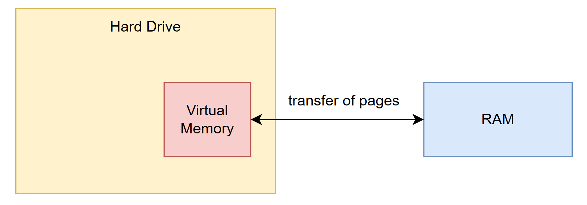
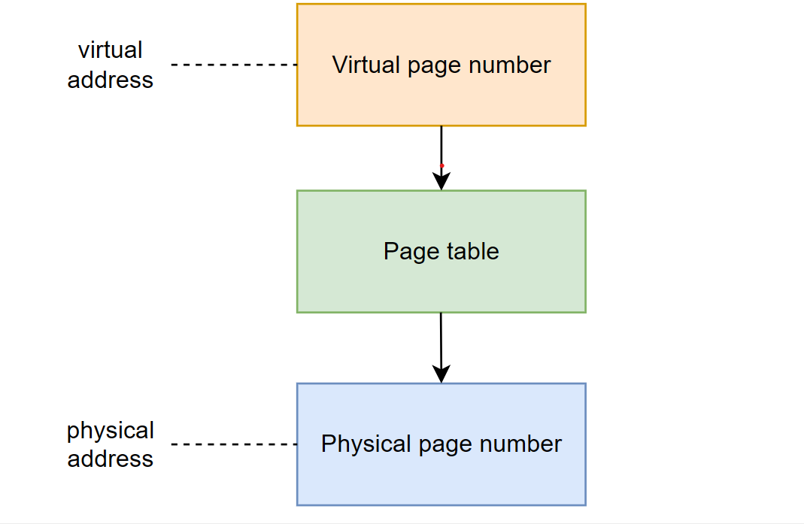
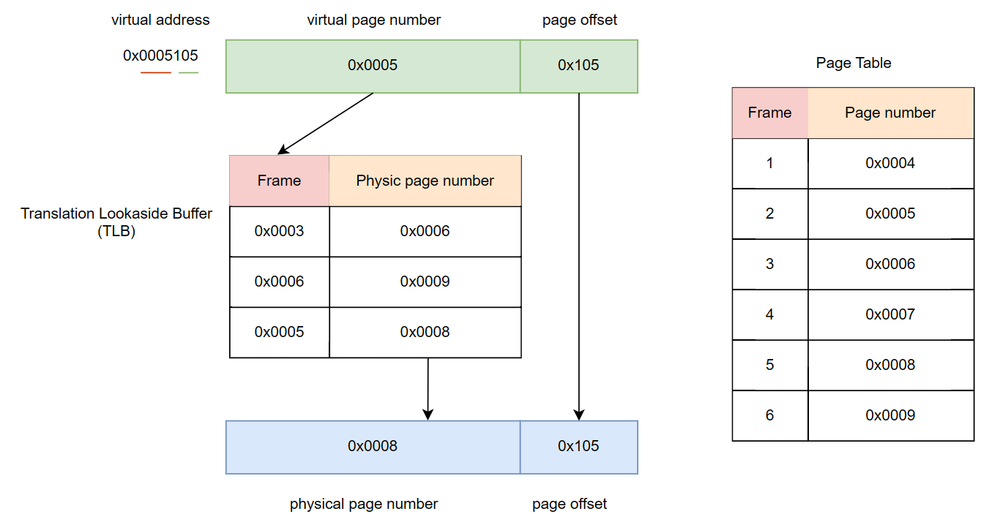

Bài viết này đi sâu vào các khía cạnh của bộ nhớ ảo, từ các nguyên tắc cơ bản đến cách hệ điều hành quản lý nó và cách các chương trình C tương tác với cơ chế mạnh mẽ này.

# 1. Giới thiệu về Bộ nhớ ảo (Virtual Memory)
Bộ nhớ ảo là kỹ thuật quản lý bộ nhớ nền tảng, tạo ảo ảnh về một bộ nhớ rất lớn cho người dùng và ứng dụng. Nó kết hợp RAM với bộ nhớ trên ổ đĩa (SSD/HDD) để tạo không gian địa chỉ liên tục. Hệ điều hành (OS), với sự hỗ trợ của phần cứng và phần mềm, ánh xạ địa chỉ ảo (chương trình sử dụng) thành địa chỉ vật lý (RAM thực tế).

Mục đích chính của bộ nhớ ảo không chỉ mở rộng dung lượng bộ nhớ vật lý bằng cách tận dụng không gian đĩa. Nó còn cung cấp bảo vệ bộ nhớ bằng cách dịch địa chỉ ảo sang vật lý, ngăn chặn truy cập trái phép. Điều này cho phép chạy các chương trình lớn hơn RAM, giải phóng ứng dụng khỏi quản lý bộ nhớ chia sẻ, tăng cường bảo mật qua cô lập bộ nhớ, và cho phép nhà phát triển sử dụng nhiều bộ nhớ hơn mức vật lý có sẵn.

Bộ nhớ ảo ra đời những năm 1960-1970 khi RAM đắt đỏ, giúp các hệ thống lớn chạy trên máy tính ít RAM, mang lại lợi ích kinh tế. Dù chi phí RAM giảm, bộ nhớ ảo vẫn thiết yếu nhờ các lợi ích phi chi phí như không gian địa chỉ ảo riêng biệt, tăng cường bảo mật và độ tin cậy, đặc biệt trong môi trường đa nhiệm. Nó đã trở thành thành phần kiến trúc cốt lõi của các hệ điều hành hiện đại, hỗ trợ bảo mật và hiệu suất cao.

Hệ thống bộ nhớ ảo đầu tiên được triển khai trên Máy tính Atlas, sử dụng phân trang. Ngày nay, bộ nhớ ảo là phần không thể thiếu của kiến trúc máy tính hiện đại, yêu cầu hỗ trợ phần cứng như MMU tích hợp trong CPU. Hầu hết các OS hiện đại chạy mỗi tiến trình trong không gian địa chỉ riêng biệt, tạo ảo giác mỗi chương trình có quyền truy cập duy nhất vào toàn bộ bộ nhớ ảo, đơn giản hóa lập trình.

# 2. Các khái niệm cốt lõi của Bộ nhớ ảo

Để hiểu bộ nhớ ảo, cần nắm vững các thành phần kỹ thuật cơ bản.

## 2.1. Địa chỉ ảo và Địa chỉ vật lý: Sự khác biệt và mối quan hệ

Trong hệ thống bộ nhớ ảo, chương trình dùng **địa chỉ ảo** (trừu tượng, liên tục) thay vì trực tiếp địa chỉ vật lý.
**Địa chỉ vật lý** là địa chỉ thực tế trong RAM nơi dữ liệu lưu trữ.

OS, với phần cứng, ánh xạ địa chỉ ảo sang vật lý. Mỗi tiến trình có không gian địa chỉ ảo riêng, tạo ảo giác truy cập bộ nhớ liên tục và độc quyền, dù RAM vật lý có thể phân mảnh và chia sẻ.

Sự ảo hóa này đơn giản hóa lập trình và tăng cường bảo mật. Nó ẩn đi sự phức tạp của bộ nhớ vật lý, cho phép lập trình viên làm việc như thể có bộ nhớ lớn, liên tục. Mỗi tiến trình có không gian địa chỉ ảo riêng, ngăn chặn truy cập trái phép, đảm bảo ổn định và bảo mật hệ thống, cho phép đa nhiệm an toàn.

## 2.2. Đơn vị quản lý bộ nhớ (MMU) và Quá trình dịch địa chỉ

MMU (Đơn vị quản lý bộ nhớ), tích hợp trong CPU, dịch địa chỉ ảo sang vật lý. CPU truy cập địa chỉ ảo, MMU dịch.

Để tăng tốc dịch, MMU dùng TLB (Translation Lookaside Buffer) lưu ánh xạ gần đây. TLB được tìm trước; nếu khớp (TLB hit), dịch nhanh. Nếu không (TLB miss), MMU hoặc OS tra cứu bảng trang chính (page walk) để tìm địa chỉ vật lý.
