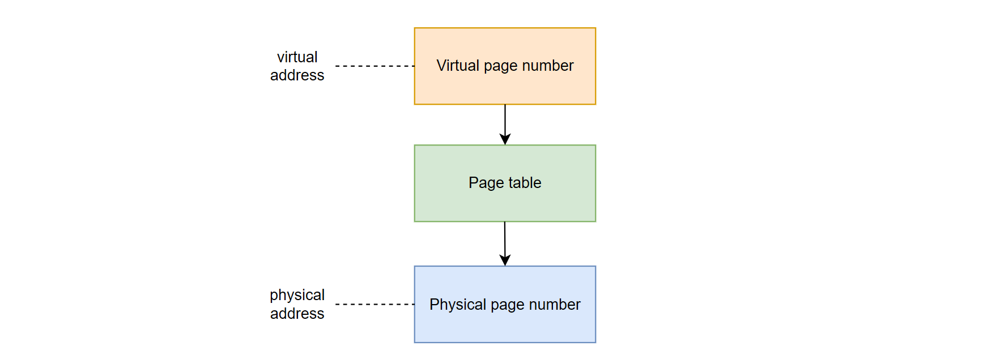
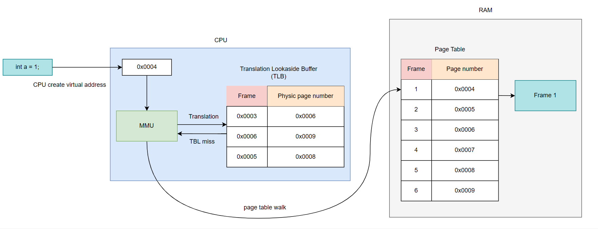
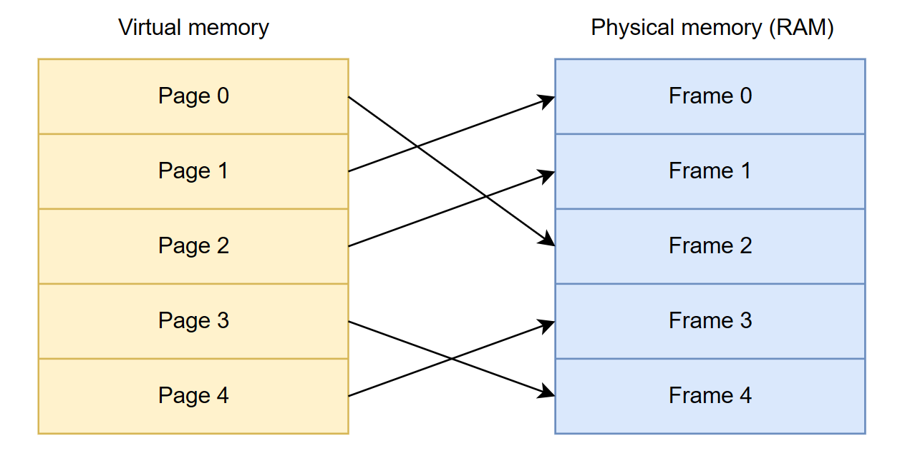
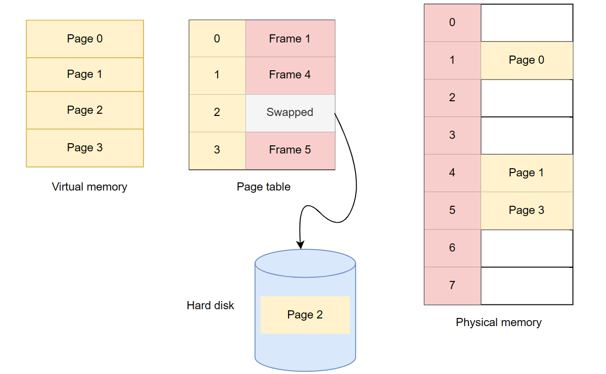
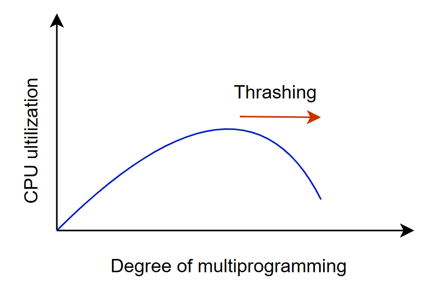
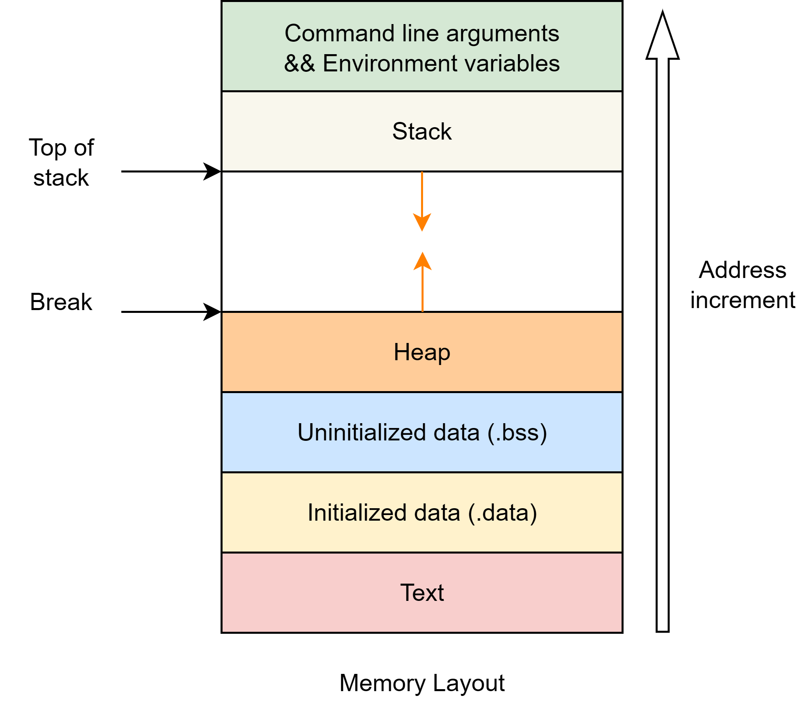

Bài viết này đi sâu vào các khía cạnh của bộ nhớ ảo, từ các nguyên tắc cơ bản đến cách hệ điều hành quản lý nó và cách các chương trình C tương tác với cơ chế mạnh mẽ này.

# 1. Đặt vấn đề
Trước khi có bộ nhớ ảo (virtual memory – bộ nhớ ảo), hệ điều hành gặp nhiều vấn đề trong quá trình quản lý bộ nhớ, đặc biệt là khi chương trình lớn hơn bộ nhớ vật lý (physical memory) hoặc khi có nhiều chương trình chạy đồng thời. Có 3 vấn đề cơ bản phổ biến có thể kể đến như:

## 1.1. Giới hạn về mặt bộ nhớ
Trước khi cơ chế bộ nhớ ảo (Virtual Memory) ra đời, các chương trình máy tính phải được nạp (load) hoàn toàn vào bộ nhớ vật lý (Physical Memory) để có thể chạy được. Điều này đã tạo ra một vấn đề lớn, đó là kích thước của chương trình bị giới hạn nghiêm trọng bởi dung lượng bộ nhớ vật lý sẵn có.

Bộ nhớ vật lý, hay còn gọi là RAM, luôn có một dung lượng nhất định. Ví dụ, một máy tính có thể chỉ có 4GB, 8GB hoặc 16GB RAM. Khi một chương trình được khởi chạy, toàn bộ mã lệnh, dữ liệu, và các tài nguyên khác của nó phải được sao chép từ bộ nhớ phụ (như ổ cứng) vào RAM. Nếu kích thước của chương trình lớn hơn dung lượng RAM còn trống, chương trình sẽ không thể được nạp và do đó không thể chạy được.


Vấn đề này đặc biệt nghiêm trọng đối với các ứng dụng lớn và phức tạp như phần mềm chỉnh sửa video, trò chơi đồ họa cao, cơ sở dữ liệu lớn, hoặc các môi trường phát triển tích hợp (IDE). Các ứng dụng này thường yêu cầu một lượng lớn bộ nhớ để hoạt động. Với mô hình cũ, người dùng sẽ liên tục gặp phải tình trạng "out of memory" (hết bộ nhớ), hoặc không thể chạy được các chương trình này ngay từ đầu.

Ngay cả khi một chương trình không quá lớn, việc chạy nhiều chương trình nhỏ cùng lúc cũng có thể gây ra vấn đề. Mỗi chương trình chiếm một phần bộ nhớ vật lý. Nếu tổng dung lượng bộ nhớ mà tất cả các chương trình đang chạy yêu cầu vượt quá khả năng của RAM, hệ thống sẽ trở nên chậm chạp hoặc "treo" (crash) do không đủ tài nguyên.

Các nhà phát triển phần mềm cũng phải đối mặt với thách thức lớn. Họ phải liên tục tối ưu hóa chương trình để giảm thiểu kích thước, hoặc chia nhỏ chương trình thành các module nhỏ hơn, phức tạp hơn để quản lý. Điều này làm tăng độ phức tạp trong quá trình phát triển và hạn chế khả năng mở rộng của ứng dụng.

Nhiều chương trình không sử dụng toàn bộ mã lệnh hoặc dữ liệu của chúng trong suốt quá trình chạy. Không phải tất cả dữ liệu đều được truy cập ngay. Tương tự như mã lệnh, một chương trình có thể quản lý lượng lớn dữ liệu (ví dụ: danh sách khách hàng trong ứng dụng CRM, các layer trong phần mềm đồ họa). Tuy nhiên, tại một thời điểm, chỉ một phần nhỏ dữ liệu này được người dùng xem hoặc chỉnh sửa.

Hậu quả: Khi toàn bộ chương trình (cả phần được dùng và không được dùng) đều phải nằm trong RAM, nó sẽ chiếm dụng một lượng lớn bộ nhớ mà thực tế không cần thiết cho hoạt động hiện tại. Điều này giống như việc bạn phải mang tất cả sách trong thư viện của mình đến lớp học, ngay cả khi bạn chỉ cần một cuốn sách duy nhất cho bài học ngày hôm đó.

Ta có đoạn code ví dụ ```my_app.c```:
```c
#include <stdio.h>

int add(int a, int b) {
    printf("Performing addition...\n");
    return a + b;
}

int subtract(int a, int b) {
    printf("Performing subtraction...\n");
    return a - b;
}

// A complex function rarely used (e.g., matrix calculation)
// Lots of code and variables for matrix operations around 100KB of code and data
void complex_matrix_calculation() {
    printf("Performing complex matrix calculation...\n");
}

int main() {
    int choice;
    int x, y;

    printf("Welcome to My Calculator Lite!\n");
    printf("1. Add\n");
    printf("2. Subtract\n");
    printf("Choose a function (1 or 2): ");

    scanf("%d", &choice);

    if (choice == 1) {
        printf("Enter the first number: ");
        scanf("%d", &x);
        printf("Enter the second number: ");
        scanf("%d", &y);
        printf("Result: %d\n", add(x, y));
    } else if (choice == 2) {
        printf("Enter the first number: ");
        scanf("%d", &x);
        printf("Enter the second number: ");
        scanf("%d", &y);
        printf("Result: %d\n", subtract(x, y));
    } else {
        printf("Invalid choice.\n");
    }

    printf("Thank you for using!\n");
    return 0;
}
```

Khi chương trình ```my_app.c``` được biên dịch thành file thực thi (ví dụ: ```my_app.exe```), nó sẽ chứa toàn bộ mã lệnh của tất cả các hàm: ```main```, ```add```, ```subtract```, ```complex_matrix_calculation``` cùng với tất cả dữ liệu toàn cục nếu có.

Giả định kích thước (minh họa):
- ```main```, ```add```, ```subtract```: Tổng cộng khoảng 20KB mã lệnh và dữ liệu.
- ```complex_matrix_calculation```: 100KB mã lệnh và dữ liệu.

Tổng kích thước của chương trình ```my_app.exe``` trên ổ cứng sẽ là khoảng 20KB+100KB = 120KB.

Khi chạy chương trình (mô hình cũ - không có Virtual Memory):

1. Khi người dùng chạy ```my_app.exe```, toàn bộ 120KB của chương trình phải được nạp hoàn toàn vào bộ nhớ vật lý (RAM).

2. Giả sử người dùng chỉ chọn chức năng "Cộng" (tức là chỉ thực thi add và các phần liên quan của main).

3. Trong suốt quá trình chạy đó, mã lệnh và dữ liệu của complex_matrix_calculation (100KB) vẫn nằm trong RAM, mặc dù chúng không hề được sử dụng.

Đây chính là sự lãng phí tài nguyên bộ nhớ. 100KB RAM đã bị chiếm giữ bởi các phần của chương trình mà tại thời điểm hiện tại không hề có ích. Nếu chúng ta có nhiều chương trình khác cũng đang chạy và mỗi chương trình đều có những phần không được sử dụng nhưng vẫn chiếm RAM, tổng cộng lượng bộ nhớ lãng phí sẽ trở nên rất lớn, dẫn đến:

- Bộ nhớ RAM nhanh chóng bị đầy.

- Hệ thống buộc phải ngừng chạy các chương trình khác hoặc từ chối khởi chạy các chương trình mới vì không đủ bộ nhớ trống.

- Hiệu suất tổng thể của hệ thống giảm sút do phải quản lý một lượng lớn bộ nhớ không cần thiết.

Sự ra đời của Virtual Memory đã giải quyết vấn đề này bằng cách chỉ nạp những phần của chương trình đang thực sự được sử dụng vào RAM, và các phần còn lại sẽ được lưu trữ trên ổ cứng (trong không gian trao đổi - swap space/paging file). Khi một phần không có trong RAM được yêu cầu, hệ điều hành sẽ tải nó vào (gọi là "demand paging" hoặc "swapping in"). Điều này giúp tối ưu hóa việc sử dụng RAM và cho phép chạy các chương trình lớn hơn cũng như nhiều chương trình hơn cùng lúc.
## 1.2. Thiếu tính bảo vệ bộ nhớ (memory protection)

## 1.3. Vấn đề về phân mảnh bộ nhớ
# 2. Khái niệm và chức năng các thành phần trong bộ nhớ ảo

## 2.1. Địa chỉ ảo và Địa chỉ vật lý

Trong một hệ thống máy tính sử dụng bộ nhớ ảo, các chương trình không trực tiếp sử dụng địa chỉ bộ nhớ vật lý. Thay vào đó, chúng hoạt động với các địa chỉ ảo. **Địa chỉ ảo** là các địa chỉ được tạo ra và sử dụng bởi chương trình, cung cấp một cái nhìn trừu tượng và liên tục về bộ nhớ. Ngược lại, **địa chỉ vật lý** là các địa chỉ thực tế trong bộ nhớ RAM (bộ nhớ truy cập ngẫu nhiên) của máy tính, nơi dữ liệu thực sự được lưu trữ.




Hệ điều hành với sự hỗ trợ của phần cứng chuyên dụng, ánh xạ địa chỉ ảo sang vật lý. Mỗi tiến trình có không gian địa chỉ ảo riêng, tạo ảo giác truy cập bộ nhớ liên tục và độc quyền, dù RAM vật lý có thể phân mảnh và chia sẻ.

Sự ảo hóa này đơn giản hóa lập trình và tăng cường bảo mật. Nó ẩn đi sự phức tạp của bộ nhớ vật lý, cho phép lập trình viên làm việc như thể có bộ nhớ lớn, liên tục. Mỗi tiến trình có không gian địa chỉ ảo riêng, ngăn chặn truy cập trái phép, đảm bảo ổn định và bảo mật hệ thống, cho phép đa nhiệm an toàn.

Khái niệm hệ điều hành 32-bit và 64-bit liên quan mật thiết đến virtual memory (bộ nhớ ảo), đặc biệt là ở chỗ không gian địa chỉ ảo (virtual address space) mà mỗi quá trình có thể truy cập được. Hệ điều hành 32-bit nghĩa là CPU và OS sử dụng địa chỉ dài 32 bit để truy cập bộ nhớ.
Tương tự, hệ điều hành 64-bit dùng địa chỉ 64 bit.

Trong kiến trúc CPU, độ dài của địa chỉ quyết định số lượng ô nhớ mà CPU có thể truy cập. 32 bit Virtual Address Space tối đa có thể là 4 GB, còn 64 bit là 256 TB. Tuy nhiên trên thực tế hệ điều hành 32-bit, một tiến trình không thể dùng quá 4 GB RAM (thường bị giới hạn ~2–3 GB do kernel chiếm phần).

## 2.2. Đơn vị quản lý bộ nhớ (MMU) và Quá trình dịch địa chỉ

MMU (Đơn vị quản lý bộ nhớ) được tích hợp trong CPU, dịch địa chỉ ảo sang vật lý. Khi CPU cần truy cập một địa chỉ bộ nhớ ảo, MMU sẽ thực hiện quá trình dịch.



Để tăng tốc độ dịch địa chỉ, MMU duy trì một bộ đệm các ánh xạ được sử dụng gần đây từ bảng trang của hệ điều hành, được gọi là Bộ đệm tra cứu dịch (TLB - Translation Lookaside Buffer). Khi một địa chỉ ảo cần được dịch, TLB sẽ được tìm kiếm trước. Nếu tìm thấy một ánh xạ khớp trong TLB (gọi là TLB hit), quá trình dịch diễn ra rất nhanh. Tuy nhiên, nếu không có khớp (gọi là TLB miss), MMU, phần mềm hệ thống hoặc trình xử lý lỗi TLB của hệ điều hành sẽ tra cứu ánh xạ địa chỉ trong bảng trang chính Page Table (gọi là page walk) để tìm địa chỉ vật lý tương ứng.
## 2.3. Phân trang (Paging) và Khung trang (Page Frames)

Phân trang chia bộ nhớ ảo thành "trang" (pages) và bộ nhớ vật lý thành "khung trang" (frames) có kích thước cố định, dao động từ 4KB đến 16KB tùy thuộc vào kiến trúc của hệ thống. Trang ảo được ánh xạ tới khung trang vật lý.



Một ưu điểm quan trọng của phân trang là nó cho phép phân bổ không gian địa chỉ không liên tục trong bộ nhớ vật lý. Điều này có nghĩa là các phần của một chương trình (các trang) có thể được lưu trữ ở các vị trí vật lý khác nhau trong RAM mà vẫn xuất hiện liên tục trong không gian địa chỉ ảo của chương trình. Cơ chế này giúp tránh vấn đề phân mảnh bộ nhớ bên ngoài, nơi các khối không gian trống nhỏ bị phân tán, khiến không có khối nào đủ lớn để chứa một yêu cầu bộ nhớ liên tục lớn.

## 2.4. Bảng trang (Page Tables) và Các mục nhập bảng trang (PTEs)

Bảng trang nằm trên RAM, lưu ánh xạ địa chỉ ảo và vật lý. Kích thước bảng trang bằng số nguyên lần kích thước của một page. Mỗi tiến trình có bảng trang riêng, đảm bảo không gian bộ nhớ ảo liên tục và cô lập.

Mỗi ánh xạ trong bảng trang được gọi là một mục nhập bảng trang (PTE - Page Table Entry). Một PTE chứa thông tin cần thiết để ánh xạ một trang ảo cụ thể tới một khung trang vật lý tương ứng. Ngoài số khung trang vật lý (PFN - Page Frame Number), PTE còn chứa nhiều thông tin phụ trợ quan trọng khác:
- **Present/Valid Bit:** Chỉ ra liệu trang có đang nằm trong bộ nhớ vật lý (RAM) hay không. Nếu bit này không được đặt, nghĩa là trang không có trong RAM, việc truy cập trang sẽ kích hoạt một Page Faults (page fault).
- **Dirty/Modified Bit:** Cho biết liệu nội dung của trang đã được sửa đổi kể từ khi nó được tải vào RAM hay chưa. Nếu trang đã bị sửa đổi, nó được coi là "dirty" và phải được ghi lại vào đĩa (hoán đổi ra ngoài) trước khi khung trang của nó có thể được giải phóng hoặc tái sử dụng.
- **Accessed Bit:** Cho biết liệu trang đã được truy cập (đọc hoặc ghi) gần đây hay không. Bit này được sử dụng bởi một số thuật toán thay thế trang (ví dụ: LRU) để theo dõi việc sử dụng trang.
- **Read/Write (Protection) Bits:** Xác định các quyền truy cập (chỉ đọc, đọc/ghi, thực thi) đối với trang. Các bit bảo vệ này rất quan trọng để tăng cường bảo mật bộ nhớ, ngăn chặn các tiến trình thực hiện các thao tác không được phép.
- **User/Supervisor Bit:** Xác định liệu trang có thể được truy cập bởi mã người dùng hay chỉ bởi kernel (chế độ đặc quyền).
- **Global Bit:** Chỉ ra rằng trang này không được xóa khỏi TLB khi chuyển đổi ngữ cảnh, hữu ích cho các trang được chia sẻ bởi nhiều tiến trình hoặc các trang kernel.
- **Process ID/Address Space ID (ASID):** Trong các hệ điều hành không phải là không gian địa chỉ đơn, thông tin này cần thiết để phân biệt các ánh xạ ảo của các tiến trình khác nhau, vì hai tiến trình có thể sử dụng cùng một địa chỉ ảo cho các mục đích khác nhau.

## 2.5. Vai trò của Hệ điều hành trong Quản lý Bộ nhớ ảo

OS quản lý bộ nhớ ảo, điều phối RAM vật lý và bộ nhớ thứ cấp để tạo ảo ảnh về không gian bộ nhớ lớn hơn.

### 2.5.1. Cơ chế phân trang và Hoán đổi (Swapping)

OS dùng phân trang để chuyển dữ liệu giữa RAM và đĩa, quản lý bộ nhớ hiệu quả. Hoán đổi (swapping) cho phép OS cấp phát bộ nhớ cho các tiến trình cần nhiều hơn RAM vật lý. Nó dùng không gian đĩa (tệp hoán đổi) như phần mở rộng của RAM. Khi RAM đầy, các trang không dùng sẽ được di chuyển đến tệp hoán đổi; khi cần, chúng được hoán đổi trở lại RAM (page swapping).



Hoán đổi cho phép chạy chương trình lớn hơn RAM và cải thiện đa nhiệm. Tuy nhiên, truy cập đĩa chậm hơn RAM, dẫn đến đánh đổi: tăng bộ nhớ đi kèm giảm hiệu suất do I/O chậm. OS phải cân bằng việc giữ trang cần thiết trong RAM và hoán đổi trang ít dùng ra đĩa để tối ưu hiệu suất. Bộ nhớ ảo không "miễn phí", có chi phí hiệu suất tiềm ẩn, đòi hỏi thuật toán quản lý thông minh từ OS.

### 2.5.2. Page Faults và cách xử lý

**Page Faults** không phải là một lỗi mà là ngoại lệ của MMU tạo ra khi tiến trình truy cập dữ liệu ảo nhưng dữ liệu không có trong RAM. Đây là hoạt động bình thường của bộ nhớ ảo, cho phép tải dữ liệu theo yêu cầu (demand paging).

**Các loại Page Faults:**
1. **Minor Page Faults (Soft Faults):** Trang được chia sẻ đã có trong RAM, OS xử lý không cần truy cập đĩa.
2. **Major Page Faults:** Trang không có trong RAM, cần tải từ đĩa (liên quan đến hoán đổi).
3. **Invalid Page Faults:** Tiến trình truy cập địa chỉ bộ nhớ không hợp lệ (lỗi lập trình), OS chấm dứt tiến trình (segmentation fault).

**Xử lý Page Faults:** CPU tạo ngắt khi truy cập trang không có trong RAM. OS chặn tiến trình, tìm trang trên đĩa, đưa vào RAM (dùng thuật toán thay thế trang nếu cần). Bảng trang được cập nhật. CPU tiếp tục thực thi. Thời gian xử lý là Thời gian phục vụ Page Faults. Hiệu suất tổng thể được tính bằng Thời gian truy cập hiệu quả (EAT):

EAT = (1-p) * Memory Access Time + p * Page fault time, với p là tỷ lệ Page Faults.

Page Faults là bình thường, nhưng nếu quá thường xuyên sẽ giảm hiệu suất. EAT cho thấy tỷ lệ Page Faults cao làm tăng thời gian truy cập bộ nhớ hiệu quả. Cần thuật toán thay thế trang và chiến lược tối ưu hóa để giảm Page Faults, tránh lãng phí CPU vào hoán đổi. Quản lý Page Faults là yếu tố then chốt quyết định hiệu suất hệ thống, đòi hỏi tinh chỉnh liên tục.

### 2.5.3. Các thuật toán thay thế trang (Page Replacement Algorithms)

Khi Page Faults xảy ra và không có khung trang trống, OS phải quyết định trang nào trong RAM sẽ bị hoán đổi ra đĩa. Mục tiêu là giảm thiểu Page Faults. "Chuỗi tham chiếu" được dùng để đánh giá hiệu quả thuật toán.

**Các thuật toán thay thế trang phổ biến:**
- **FIFO:** Thay thế trang cũ nhất.
- **Optimal (OPT/MIN):** Tỷ lệ Page Faults thấp nhất, thay thế trang không dùng lâu nhất trong tương lai. Lý thuyết, không thực tế vì cần biết trước tương lai.
- **LRU:** Thay thế trang không dùng lâu nhất. Xấp xỉ tốt cho OPT, dễ thực hiện.
- **LFU:** Thay thế trang ít được sử dụng nhất. Có thể không hiệu quả nếu trang được dùng nhiều ban đầu nhưng sau đó không dùng lại.

Các thuật toán này cho thấy đánh đổi giữa thực tiễn và hiệu suất. OPT có tỷ lệ Page Faults thấp nhất nhưng không thực tế. FIFO và LRU thực tế hơn. LRU hiệu quả hơn FIFO vì xấp xỉ OPT. Thiết kế hệ thống luôn đánh đổi giữa hiệu suất lý tưởng và khả thi. OPT là chuẩn mực lý thuyết để đánh giá thuật toán thực tế, thúc đẩy phát triển thuật toán thay thế trang thông minh hơn.

### 2.5.4. Hiện tượng Thrashing

**Thrashing** là tình trạng hệ thống dành quá nhiều thời gian hoán đổi trang thay vì thực thi tiến trình. Thiếu RAM gây Page Faults thường xuyên, buộc OS hoán đổi liên tục. Hoạt động này tiêu tốn CPU và I/O, giảm hiệu suất, dẫn đến nhiều Page Faults hơn.



**Nguyên nhân thrashing:**
1. **Đa chương trình cao:** Quá nhiều tiến trình chạy đồng thời, không đủ RAM cho các trang cần thiết.
2. **Thiếu khung trang:** Không đủ khung trang cho tiến trình, gây hoán đổi thường xuyên.
3. **Chính sách thay thế trang không hiệu quả:** Thuật toán hoán đổi không tối ưu, loại bỏ trang sẽ sớm dùng lại.
4. **RAM vật lý không đủ:** Hệ thống không đủ RAM cho khối lượng công việc.

**Dấu hiệu thrashing:**
1. **CPU cao, hiệu suất thấp:** CPU dành nhiều thời gian xử lý Page Faults và hoán đổi.
2. **Hoạt động đĩa tăng:** Ổ đĩa liên tục đọc/ghi trang hoán đổi.
3. **Tỷ lệ Page Faults cao:** Page Faults tăng vọt, tiến trình liên tục truy cập trang không có trong RAM.
4. **Thời gian phản hồi chậm:** Hệ thống chậm, ứng dụng tải và phản hồi lâu.

Tác động nghiêm trọng: chậm ứng dụng, tăng tải hệ thống, có thể treo hoặc sập ứng dụng.

**Khắc phục thrashing:**
- **Tăng RAM vật lý:** Hiệu quả nhất để giảm hoán đổi.
- **Giảm đa chương trình:** Giảm tiến trình chạy đồng thời để mỗi tiến trình có đủ khung trang.
- **Chính sách thay thế trang hiệu quả:** Chọn thuật toán tốt hơn (ví dụ: LRU) để giảm Page Faults.
- **Tối ưu hóa ứng dụng:** Thiết kế ứng dụng dùng bộ nhớ hiệu quả, tránh rò rỉ.
- **Theo dõi tài nguyên:** Dùng công cụ giám sát để xác định sớm dấu hiệu thrashing.

Thrashing cho thấy giới hạn của bộ nhớ ảo khi thiếu tài nguyên vật lý. Bộ nhớ ảo mạnh mẽ nhưng không thay thế RAM vật lý. Quản lý bộ nhớ ảo cần giám sát và điều chỉnh chủ động để ngăn hệ thống sập.

## 2.6. Bộ nhớ ảo trong Lập trình C
### 2.6.1. Cấu trúc bộ nhớ của chương trình C

Chương trình C được tổ chức thành các phân đoạn (segments) riêng biệt trong không gian địa chỉ ảo của tiến trình, mỗi phân đoạn có mục đích cụ thể.



1. Text Segment (Code Segment): Lưu mã thực thi đã biên dịch, thường chỉ đọc để bảo mật.
2. Data Segment: Lưu biến toàn cục và tĩnh đã khởi tạo. Chia thành:
- Initialized Data Segment (khởi tạo rõ ràng)
- Uninitialized Data Segment (BSS) (không khởi tạo, tự động bằng 0).
3. Heap Segment: Vùng cấp phát bộ nhớ động, bắt đầu từ cuối BSS và phát triển lên. Quản lý bởi malloc(), realloc(), free().
4. Stack Segment: Vùng cho biến cục bộ và quản lý lời gọi hàm. Mỗi lời gọi tạo khung ngăn xếp. Ngăn xếp phát triển ngược chiều với heap (từ địa chỉ cao xuống thấp). Heap và stack phát triển về phía nhau; khi gặp nhau, chương trình hết bộ nhớ ảo.

Cấu trúc bộ nhớ chương trình C là các phân đoạn trong không gian địa chỉ ảo, không phải vật lý. Heap và Stack phát triển ngược chiều; khi gặp nhau sẽ gây ra lỗi Stack overflow hay Out of memory bản chất là hết bộ nhớ ảo khả dụng.

### 2.6.2. Phân mảnh bộ nhớ (Memory Fragmentation)

Phân mảnh bộ nhớ là một vấn đề cố hữu trong quản lý bộ nhớ, có thể ảnh hưởng đến hiệu suất hệ thống. Có hai loại chính:

- **Internal Fragmentation (Phân mảnh nội bộ):** Xảy ra khi có không gian không sử dụng bên trong một khối bộ nhớ được cấp phát. Trong hệ thống phân trang, điều này xảy ra vì hệ điều hành cấp phát bộ nhớ theo bội số của kích thước trang. Nếu yêu cầu bộ nhớ của một tiến trình không trùng khớp chính xác với ranh giới trang, khung cuối cùng được cấp phát có thể không được sử dụng đầy đủ, dẫn đến không gian lãng phí. Ví dụ, nếu kích thước trang là 4KB và một tiến trình cần 4097 byte, nó sẽ được cấp phát hai trang (8KB), lãng phí gần 4KB trong trang thứ hai.
- **External Fragmentation (Phân mảnh bên ngoài):** Xảy ra khi có nhiều khối không gian trống nhỏ rải rác trong bộ nhớ, nhưng không có khối nào đủ lớn để đáp ứng một yêu cầu cấp phát lớn, ngay cả khi tổng không gian trống đủ. Phân trang được thiết kế để giúp tránh phân mảnh bên ngoài vì bất kỳ khung trống nào cũng có thể được sử dụng để chứa một trang, bất kể vị trí của nó.

Tuy nhiên, trong heap, các cuộc gọi malloc() và free() liên tục có thể tạo ra các "lỗ hổng" không gian trống giữa các khối bộ nhớ được cấp phát. Mặc dù hệ thống có thể tái sử dụng các địa chỉ ảo này từ danh sách các khối trống của trình quản lý heap, việc phân mảnh có thể khiến không có khối trống nào đủ lớn để đáp ứng các yêu cầu cấp phát lớn liên tục, buộc heap phải mở rộng bằng cách yêu cầu thêm bộ nhớ ảo từ hệ điều hành.

## 2.7. Ánh xạ tệp vào bộ nhớ (mmap)

Ngoài các cơ chế cấp phát bộ nhớ động tiêu chuẩn, C còn cung cấp các kỹ thuật nâng cao cho phép các chương trình tương tác trực tiếp với bộ nhớ ảo để xử lý tệp và bộ nhớ, nổi bật nhất là thông qua hàm ```mmap()```.

### 2.7.1. Khái niệm và Ưu điểm của mmap()

```mmap()``` là một lệnh gọi hệ thống (system call) mạnh mẽ ánh xạ các tệp hoặc thiết bị vào không gian bộ nhớ ảo của một tiến trình. Khi một tệp được ánh xạ vào bộ nhớ, tiến trình có một vùng bộ nhớ tương ứng với cấu trúc chính xác của tệp. Điều này tạo ra ảo giác rằng toàn bộ nội dung tệp đã được sao chép vào bộ nhớ, cho phép chương trình truy cập dữ liệu tệp như thể đó là một mảng trong bộ nhớ, sử dụng các thao tác con trỏ thông thường.

Các ưu điểm chính của mmap() so với các phương pháp I/O truyền thống bao gồm:

- **Chia sẻ bộ nhớ:** mmap() cho phép nhiều tiến trình chia sẻ quyền truy cập chỉ đọc vào cùng một tệp chung. Ví dụ điển hình là thư viện C chuẩn (
glibc.so), được ánh xạ vào tất cả các tiến trình chạy chương trình C, đảm bảo chỉ một bản sao của tệp cần được tải vào bộ nhớ vật lý, ngay cả khi có hàng nghìn chương trình đang chạy.
- **Đơn giản hóa I/O:** Nó đơn giản hóa logic chương trình bằng cách cho phép truy cập dữ liệu tệp trực tiếp thông qua một con trỏ, giống như một mảng byte, thay vì sử dụng các hàm I/O truyền thống như fseek() và read() để di chuyển con trỏ tệp và đọc từng khối.
- **Truy cập hiệu quả:** mmap() có thể bỏ qua bộ đệm kernel, sao chép dữ liệu trực tiếp vào bộ nhớ chế độ người dùng. Điều này cải thiện hiệu suất cho các lần đọc ban đầu và đặc biệt là cho các mẫu truy cập ngẫu nhiên vào các tệp lớn.
- **IPC nhanh:** Nếu vùng được ánh xạ được đặt là có thể ghi (```MAP_SHARED``` với ```PROT_WRITE```), nó cung cấp trao đổi dữ liệu liên tiến trình (IPC) cực nhanh. Dữ liệu được ghi bởi một tiến trình sẽ ngay lập tức có thể truy cập được bởi các tiến trình khác mà không cần gọi các lệnh hệ thống bổ sung.
- **Xử lý tệp lớn:** mmap() rất hiệu quả để xử lý các tệp lớn, đặc biệt khi yêu cầu truy cập ngẫu nhiên hoặc lặp lại các phần tệp.

mmap() không chỉ là một cách để đọc/ghi tệp mà còn là một cơ chế mạnh mẽ để tích hợp tệp vào không gian địa chỉ ảo của tiến trình. Điều này cho phép các hoạt động trên tệp được thực hiện như các hoạt động trên bộ nhớ thông thường, tận dụng các cơ chế quản lý bộ nhớ ảo của hệ điều hành (phân trang, TLB) để tối ưu hóa truy cập. Khả năng ánh xạ các tệp lớn vượt quá RAM vật lý là một minh chứng cho sức mạnh của bộ nhớ ảo.

mmap là một ví dụ điển hình về cách các lập trình viên C có thể khai thác trực tiếp các tính năng của bộ nhớ ảo để đạt được hiệu suất cao và đơn giản hóa mã cho các tác vụ I/O phức tạp, đặc biệt trong các ứng dụng xử lý dữ liệu lớn.

### 2.7.2. Cách sử dụng mmap() để xử lý các tệp lớn và cấp phát bộ nhớ vượt quá RAM vật lý

Cú pháp cơ bản của hàm mmap() là:

```c
void *mmap(void *addr, size_t length, int prot, int flags, int fd, off_t offset);
``` 
- **addr:** Địa chỉ mong muốn để ánh xạ tệp (thường là NULL để hệ điều hành tự chọn).
- **length:** Kích thước của vùng bộ nhớ để ánh xạ (tính bằng byte).
- **prot:** Quyền bảo vệ cho vùng bộ nhớ (ví dụ: ```PROT_READ``` để đọc, ```PROT_WRITE``` để ghi, ```PROT_EXEC``` để thực thi).
- **flags:** Các cờ kiểm soát hành vi của ánh xạ (ví dụ: ```MAP_SHARED``` để chia sẻ ánh xạ với các tiến trình khác, ```MAP_PRIVATE``` để tạo một bản sao riêng tư).
- **fd:** Mô tả tệp (file descriptor) của tệp cần ánh xạ.
- **offset:** Độ lệch (offset) trong tệp mà ánh xạ sẽ bắt đầu.

Hàm ```munmap()``` được sử dụng để hủy ánh xạ một vùng bộ nhớ đã được ánh xạ trước đó.
mmap() đặc biệt hữu ích cho việc xử lý các tệp lớn hơn RAM vật lý của hệ thống. Trên các hệ thống 64-bit, không gian địa chỉ ảo có thể lên tới 256 TiB (2^48 byte), cho phép ánh xạ các tệp rất lớn vào không gian địa chỉ ảo của tiến trình. Tuy nhiên, cần lưu ý quan trọng rằng trên các hệ thống 32-bit, việc ánh xạ các tệp lớn có thể gặp khó khăn do yêu cầu các khối bộ nhớ ảo liên tục lớn, điều này có thể khó đạt được trên một hệ thống đã tải.

Dưới đây là một ví dụ mã C minh họa cách sử dụng mmap() để đọc và ghi vào một tệp:

```c
#include <fcntl.h>
#include <stdio.h>
#include <stdlib.h>
#include <string.h>
#include <sys/mman.h>
#include <sys/stat.h>
#include <sys/types.h>
#include <unistd.h>

#define FILE_SIZE 1024

int main() {
    int fd;
    char* map;
    struct stat fileInfo;
    const char* test_data = "Hello Virtual Memory!";
    size_t data_len = strlen(test_data);

    fd = open("mmap_example.txt", O_RDWR | O_CREAT, S_IRUSR | S_IWUSR);
    if (fd == -1) {
        perror("Error opening/creating file");
        return EXIT_FAILURE;
    }

    if (ftruncate(fd, data_len) == -1) {
        perror("Error truncating file");
        close(fd);
        return EXIT_FAILURE;
    }
    
    if (fstat(fd, &fileInfo) == -1) {
        perror("Error getting file info");
        close(fd);
        return EXIT_FAILURE;
    }

    map = mmap(0, fileInfo.st_size, PROT_READ | PROT_WRITE, MAP_SHARED, fd, 0);
    if (map == MAP_FAILED) {
        perror("Error mmapping the file");
        close(fd);
        return EXIT_FAILURE;
    }

    close(fd);

    printf("Writing to mapped memory: \"%s\"\n", test_data);
    memcpy(map, test_data, data_len);
    printf("Reading from mapped memory: \"%.*s\"\n", (int)fileInfo.st_size, map);

    if (munmap(map, fileInfo.st_size) == -1) {
        perror("Error unmapping the file");
        return EXIT_FAILURE;
    }

    printf("Memory unmapped successfully.\n");
    return EXIT_SUCCESS;
}
```
### 2.7.3. So sánh mmap() với I/O truyền thống (read() / write())

Khi lựa chọn phương pháp truy cập tệp trong C, việc so sánh mmap() với các hàm I/O truyền thống như read() và write() là rất quan trọng. mmap() thường vượt trội hơn read()/write() trong các kịch bản liên quan đến tệp lớn và các mẫu truy cập ngẫu nhiên. Điều này là do
mmap() ánh xạ toàn bộ tệp vào không gian địa chỉ ảo, cho phép CPU truy cập dữ liệu trực tiếp mà không cần các lệnh gọi hệ thống (system call) lặp lại cho mỗi lần đọc/ghi nhỏ. Việc tránh overhead của nhiều system call và tận dụng cơ chế phân trang hiệu quả của hệ điều hành mang lại lợi thế về hiệu suất đáng kể.

Ngược lại, read() và write() yêu cầu các system call cho mỗi hoạt động I/O, tạo ra chi phí đáng kể cho truy cập ngẫu nhiên hoặc lặp lại. Tuy nhiên, chúng thích hợp hơn cho các tệp nhỏ hoặc truy cập tuần tự, nơi sự đơn giản và tính di động của mã quan trọng hơn hiệu suất thô.

Lựa chọn công cụ dựa trên mẫu truy cập dữ liệu là một quyết định thiết kế quan trọng. mmap hiệu quả hơn read/write cho truy cập ngẫu nhiên và tệp lớn vì nó ánh xạ toàn bộ tệp vào không gian địa chỉ, cho phép CPU truy cập dữ liệu trực tiếp mà không cần system call lặp lại cho mỗi lần đọc/ghi nhỏ. Ngược lại, read/write yêu cầu các system call cho mỗi hoạt động I/O, tạo ra chi phí đáng kể cho truy cập ngẫu nhiên hoặc lặp lại. Điều này dẫn đến kết luận rằng lựa chọn giữa mmap và I/O truyền thống nên dựa trên mẫu truy cập dữ liệu dự kiến (tuần tự so với ngẫu nhiên, tệp nhỏ so với tệp lớn). Lập trình viên cần phân tích kỹ lưỡng yêu cầu I/O của ứng dụng để chọn phương pháp truy cập tệp tối ưu, từ đó ảnh hưởng trực tiếp đến hiệu suất và độ phức tạp của mã.

# 3. Tổng kết
## 3.1. Vai trò bộ nhớ ảo

Bộ nhớ ảo mang lại nhiều lợi ích quan trọng, làm nền tảng cho các hệ thống máy tính hiện đại và đơn giản hóa đáng kể quá trình phát triển phần mềm.

### 3.1.1. Cải thiện đa nhiệm và cô lập bộ nhớ
Bộ nhớ ảo tăng cường khả năng đa nhiệm của hệ điều hành bằng cách cho phép nhiều tiến trình chạy đồng thời một cách hiệu quả. Mỗi tiến trình được cấp một không gian bộ nhớ ảo riêng biệt, tạo ra ảo giác về một khối bộ nhớ lớn và liên tục dành riêng cho nó. Cơ chế này ngăn chặn các tiến trình can thiệp vào dữ liệu của nhau, tăng cường đáng kể bảo mật và độ tin cậy của hệ thống. Khả năng cô lập bộ nhớ và hỗ trợ đa nhiệm là hai lợi ích cốt lõi của bộ nhớ ảo. Chúng không chỉ là những tính năng bổ sung mà là những yêu cầu cơ bản cho bất kỳ hệ điều hành hiện đại nào. Nếu không có bộ nhớ ảo, việc chạy nhiều chương trình an toàn và hiệu quả sẽ cực kỳ khó khăn, nếu không muốn nói là không thể. Điều này khẳng định vai trò không thể thiếu của bộ nhớ ảo trong việc định hình cách các hệ điều hành hiện đại hoạt động và tương tác với các ứng dụng, cho phép sự phức tạp và độ tin cậy mà chúng ta mong đợi.

### 3.1.2. Sử dụng RAM hiệu quả và khả năng chạy các chương trình lớn

Bộ nhớ ảo cho phép hệ thống sử dụng RAM hiệu quả hơn bằng cách quản lý không gian động dựa trên nhu cầu của các ứng dụng đang hoạt động. Nó mở rộng dung lượng bộ nhớ khả dụng bằng cách sử dụng không gian đĩa làm phần mở rộng của RAM, cho phép chạy các chương trình lớn hơn bộ nhớ vật lý thực tế. Một tính năng quan trọng là "tải theo yêu cầu" (load on demand) hay lazy loading, trong đó chỉ các phần cần thiết của một chương trình mới được tải vào bộ nhớ vật lý khi chúng thực sự được truy cập. Điều này giúp giảm thời gian khởi động ứng dụng và lượng RAM vật lý ban đầu được sử dụng.

### 3.1.3. Đơn giản hóa phát triển chương trình

Đối với lập trình viên, bộ nhớ ảo đơn giản hóa đáng kể việc quản lý bộ nhớ. Họ không phải quản lý việc cấp phát bộ nhớ vật lý trực tiếp hoặc lo lắng về sự phân mảnh của bộ nhớ vật lý. Thay vào đó, lập trình viên có thể lập trình "như thể" có một khối bộ nhớ lớn, liên tục và không bị giới hạn. Sự trừu tượng hóa này cho phép họ tập trung vào logic ứng dụng phức tạp hơn, làm cho quá trình phát triển phần mềm hiệu quả và ít lỗi hơn.

## 3.2. Nhược điểm và Thách thức của Bộ nhớ ảo
Mặc dù có nhiều ưu điểm, bộ nhớ ảo cũng đi kèm với những hạn chế và thách thức riêng cần được xem xét.

### 3.2.1. Hiệu suất chậm hơn và chi phí hoạt động

Một trong những nhược điểm chính của bộ nhớ ảo là hiệu suất chậm hơn tiềm ẩn. Truy cập đĩa chậm hơn đáng kể so với truy cập RAM. Do đó, khi hoán đổi trang diễn ra thường xuyên (ví dụ, trong tình trạng thrashing), hệ thống có thể gặp phải các nút thắt cổ chai về hiệu suất, dẫn đến thời gian phản hồi chậm và trải nghiệm người dùng kém. Ngoài ra, bộ nhớ ảo yêu cầu chi phí hoạt động bổ sung của hệ điều hành để quản lý hiệu quả. Điều này bao gồm việc duy trì và tra cứu bảng trang, xử lý lỗi trang, và thực hiện các thuật toán thay thế trang.

Bộ nhớ ảo mang lại sự tiện lợi lớn cho lập trình viên và cho phép các hệ thống chạy nhiều chương trình lớn hơn. Tuy nhiên, sự tiện lợi này không "miễn phí". Chi phí bao gồm thời gian truy cập bộ nhớ chậm hơn (do truy cập đĩa) và chi phí CPU cho việc quản lý bảng trang và xử lý lỗi trang. Điều này ngụ ý rằng có một "chi phí ẩn" cho sự trừu tượng hóa và linh hoạt mà bộ nhớ ảo cung cấp. Lập trình viên và quản trị viên hệ thống cần hiểu rõ chi phí này để tối ưu hóa ứng dụng và cấu hình hệ thống, đảm bảo rằng lợi ích của bộ nhớ ảo không bị lu mờ bởi các vấn đề về hiệu suất.

### 3.2.2. Rủi ro mất dữ liệu và độ phức tạp của hệ thống

Việc di chuyển dữ liệu liên tục giữa RAM và ổ cứng (hoặc SSD) làm tăng rủi ro mất dữ liệu trong trường hợp mất điện đột ngột hoặc lỗi đĩa trong quá trình truyền tải. Dữ liệu đang được hoán đổi có thể bị hỏng hoặc mất nếu hệ thống gặp sự cố. Hơn nữa, việc quản lý bộ nhớ ảo làm tăng đáng kể độ phức tạp cho khối lượng công việc của hệ điều hành. Thiết kế và duy trì một hệ thống bộ nhớ ảo mạnh mẽ, hiệu quả đòi hỏi các cơ chế phức tạp để xử lý ánh xạ địa chỉ, lỗi trang, hoán đổi và các chính sách thay thế.

Mặc dù bộ nhớ ảo đơn giản hóa lập trình ở một cấp độ cao hơn, nó lại tăng cường đáng kể độ phức tạp ở cấp độ hệ điều hành. Việc quản lý các ánh xạ, xử lý lỗi trang, và quyết định hoán đổi trang đòi hỏi một cơ chế phức tạp và đáng tin cậy. Sự phức tạp này, cùng với việc phụ thuộc vào đĩa, cũng giới thiệu các điểm lỗi tiềm ẩn mới, chẳng hạn như rủi ro mất dữ liệu trong trường hợp hệ thống gặp sự cố trong quá trình hoán đổi. Điều này nhấn mạnh rằng việc triển khai bộ nhớ ảo là một thách thức kỹ thuật lớn đối với các nhà phát triển hệ điều hành, đòi hỏi sự cân nhắc kỹ lưỡng về độ tin cậy và khả năng phục hồi.

## 3.3. Kết luận
Tóm lại, bộ nhớ ảo đã phát triển từ một giải pháp tiết kiệm chi phí thành một thành phần kiến trúc cốt lõi, thiết yếu cho các hệ điều hành hiện đại. Việc hiểu sâu sắc về các nguyên tắc, cơ chế và tương tác của bộ nhớ ảo, đặc biệt là trong ngữ cảnh lập trình C, là điều tối quan trọng đối với các nhà phát triển và quản trị viên hệ thống. Kiến thức này cho phép tối ưu hóa hiệu suất ứng dụng, đảm bảo tính ổn định của hệ thống và thiết kế các giải pháp phần mềm mạnh mẽ, đáng tin cậy trong bối cảnh tài nguyên bộ nhớ ngày càng phức tạp.